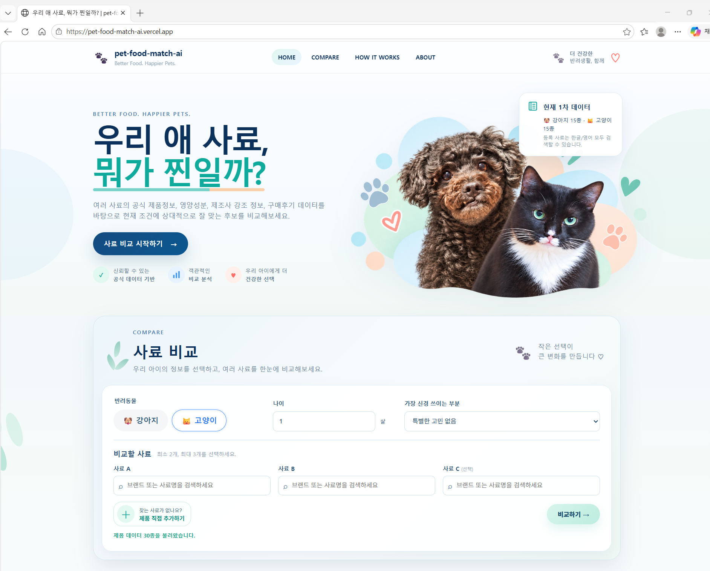
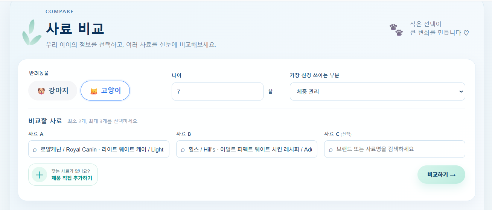
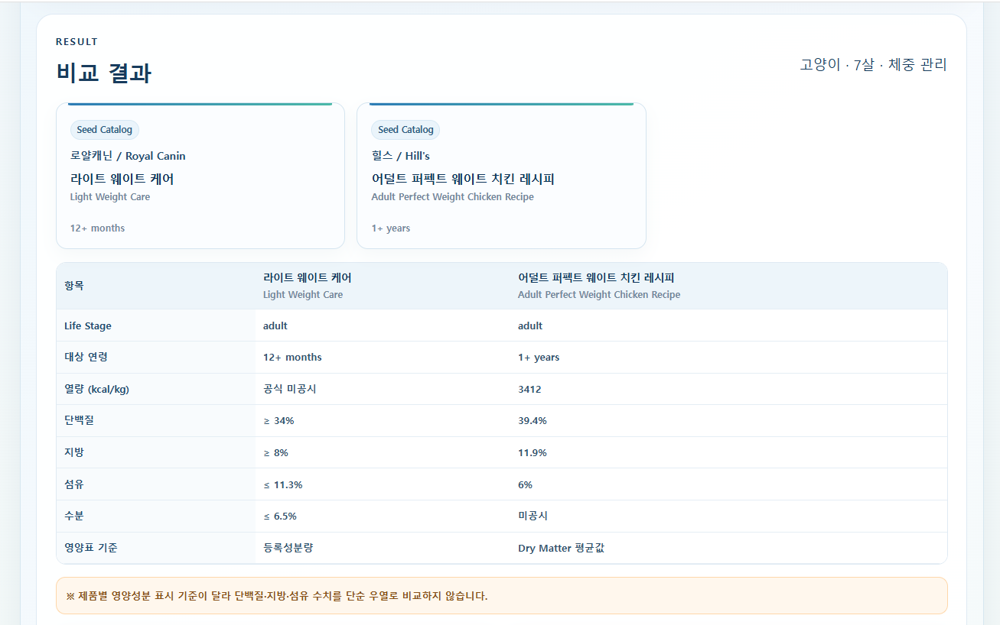
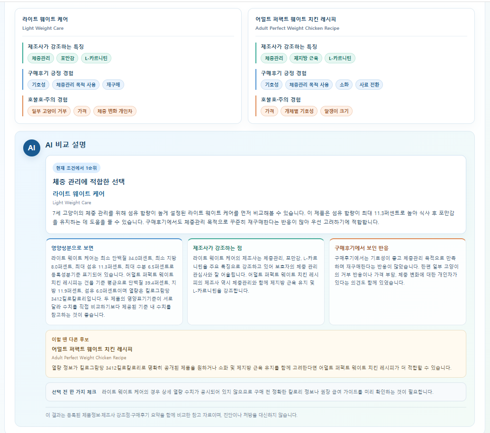
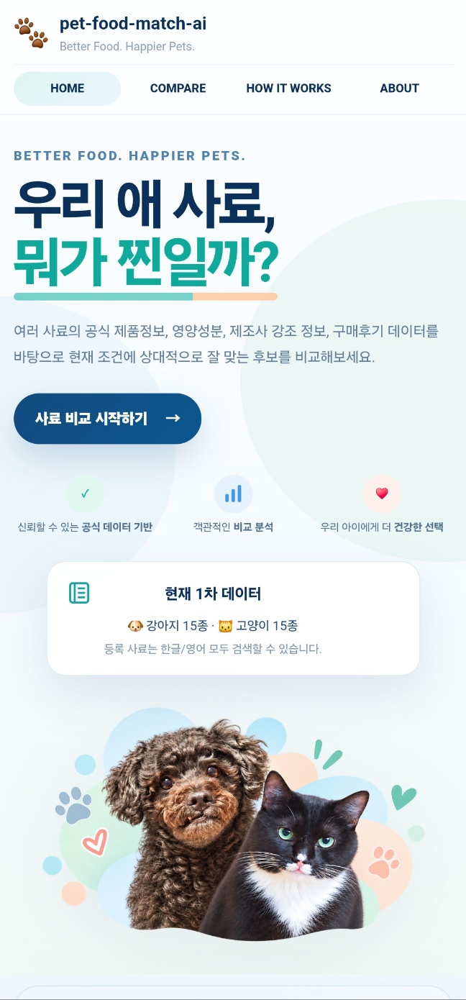
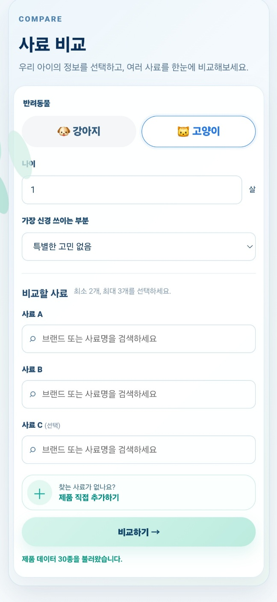
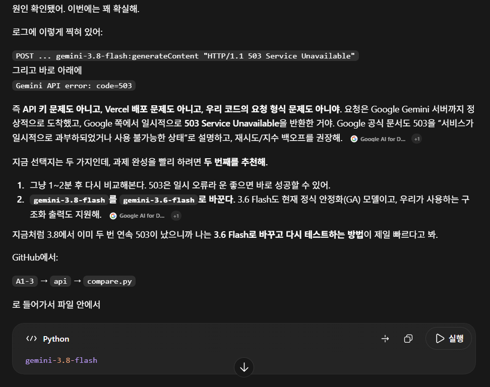
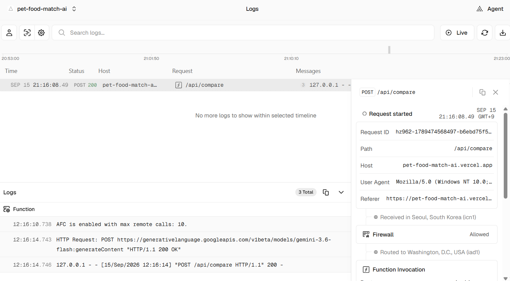
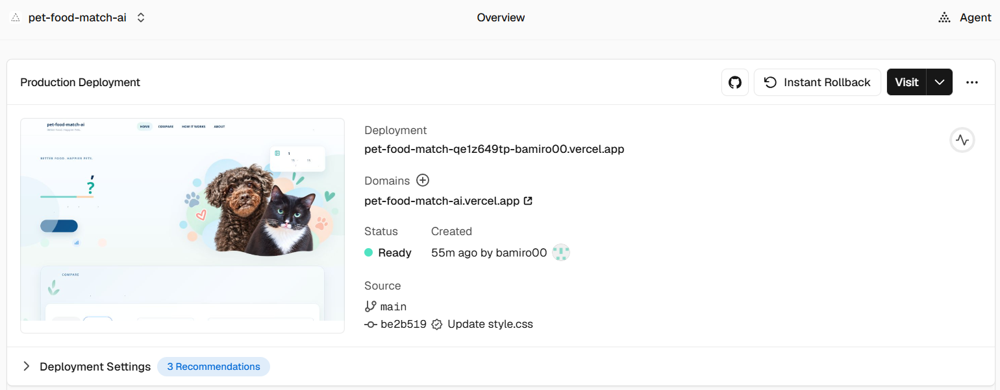

# 우리 애 사료, 뭐가 찐일까?

> 프로젝트명: `pet-food-match-ai`

반려동물의 종류, 나이, 관심사항과 2~3개 사료의 등록 제품정보를 한 화면에서 비교하고, Google Gemini가 **영양정보·제조사 강조점·구매후기 근거**를 바탕으로 현재 조건에서 먼저 비교해볼 후보를 설명하는 AI 웹 서비스입니다.

- **배포 주소:** https://petfood-match.vercel.app
- **GitHub:** https://github.com/bamiro00/codyssey-save/tree/main/A1-3

<details open>
<summary><b>서비스 메인 화면 보기</b></summary>

<br>



</details>

---

## 1. 페이지/섹션 구성 및 네비게이션

이 서비스는 여러 HTML 파일로 나눈 다중 페이지 방식이 아니라, **하나의 `index.html` 안에 4개의 주요 콘텐츠 섹션을 구성한 Single Page 방식**입니다.

서비스는 다음 **4개의 독립적인 주요 섹션**으로 구성했습니다.

| 상단 메뉴 | 섹션 ID | 역할 |
|---|---|---|
| HOME | `#home` | 서비스 소개, 핵심 가치, 1차 데이터 현황 안내 |
| COMPARE | `#compare` | 반려동물 정보 입력, 사료 검색/선택, 비교 실행 |
| HOW IT WORKS | `#how` | 공식 데이터 검증부터 AI 설명까지 서비스 이용 과정 안내 |
| ABOUT | `#about` | 서비스 목적, 활용 범위, 주의사항 안내 |

상단 메뉴는 HTML 앵커 링크로 구성되어 있으며 각 메뉴를 클릭하면 해당 섹션으로 실제 이동합니다.

```html
<a href="#home">HOME</a>
<a href="#compare">COMPARE</a>
<a href="#how">HOW IT WORKS</a>
<a href="#about">ABOUT</a>
```

각 링크는 `index.html` 내부의 `id="home"`, `id="compare"`, `id="how"`, `id="about"` 요소와 연결되어 있습니다. CSS의 `scroll-behavior: smooth`를 적용해 메뉴 클릭 시 부드럽게 이동합니다.

별도의 `home.html`, `compare.html` 등을 나누지 않고도, **4개의 주요 섹션을 한 페이지 안에서 독립적으로 구성하고 상단 메뉴로 각 영역을 바로 이동할 수 있게 만들었습니다.**

---

## 2. 서비스 기획 배경

반려동물 사료를 고를 때 제품마다 영양성분 표시 방식이 다르고, 제조사가 강조하는 특징과 실제 구매후기까지 따로 확인해야 해서 비교가 번거롭습니다.

이 프로젝트는 사용자가 **반려동물 종류·나이·관심사항**을 입력하고 비교할 사료를 선택하면, 등록된 제품정보를 한 화면에서 정리한 뒤 AI가 해당 조건에 맞춰 비교 설명을 제공하도록 설계했습니다.

### 주요 사용자

- 여러 사료 중 어떤 제품을 먼저 비교할지 고민하는 반려인
- 영양성분·제조사 특징·구매후기를 한 번에 보고 싶은 사용자
- 강아지/고양이의 나이와 체중관리·기호성·소화 등 조건을 함께 고려하고 싶은 사용자

---

## 3. 주요 기능

### 3-1. 반려동물 정보와 사료 선택

사용자는 다음 정보를 입력합니다.

- 반려동물: 강아지 / 고양이
- 나이
- 가장 신경 쓰이는 부분
- 비교할 사료 2~3개

Seed Catalog에는 **강아지 15종 + 고양이 15종, 총 30종**이 등록되어 있으며 한글/영문 제품명을 **1글자부터 검색**할 수 있습니다. 등록되지 않은 제품은 사용자가 직접 입력할 수도 있습니다.

<details>
<summary><b>사료 비교 입력 화면 보기</b></summary>

<br>



</details>

### 3-2. 제품정보 비교

선택한 제품의 다음 정보를 표로 비교합니다.

- Life Stage
- 대상 연령
- kcal/kg
- 단백질
- 지방
- 섬유
- 수분
- 영양표 기준

제품별 영양성분 표시 기준이 다를 수 있기 때문에 **보장성분량·Dry Matter 평균값 등 기준이 다르면 단순 수치 우열로 비교하지 않도록** 안내합니다.

<details>
<summary><b>영양정보 비교 결과 보기</b></summary>

<br>



</details>

### 3-3. 제조사 강조점과 구매후기 구분

단순 영양성분뿐 아니라 제품별 근거 데이터를 다음과 같이 구분해 보여줍니다.

- **제조사가 강조하는 특징**: 체중관리, 포만감, L-카르니틴 등
- **구매후기 긍정 경험**: 기호성, 체중관리 목적 사용, 재구매 등
- **호불호·주의 경험**: 가격, 알갱이 크기, 개체별 기호성 차이 등

각 항목은 색상을 다르게 표시해 근거의 성격을 구분했습니다.

### 3-4. Gemini AI 비교 설명

프런트엔드에서 선택된 제품정보를 `/api/compare`로 전송하면 Python Serverless Function이 Gemini API를 호출합니다.

AI 결과는 다음 구조로 출력됩니다.

1. 현재 조건에서 1순위 후보와 **2~3문장 결론**
2. 영양성분 비교 근거
3. 제조사가 강조하는 점
4. 구매후기에서 보인 반응
5. 다른 후보가 더 맞을 수 있는 상황
6. 선택 전 확인할 사항

AI가 제품 ID나 내부 필드명을 그대로 노출하지 않도록 서버에서 응답을 정리하고, 등록 데이터에 없는 사실을 임의로 만들어내지 않도록 프롬프트를 제한했습니다.

<details open>
<summary><b>AI 비교 추천 결과 보기</b></summary>

<br>



</details>

---

## 4. 사용자 입력 → AI 결과 흐름

```text
사용자 입력
   ↓
JavaScript 입력 검증
   ↓
제품 비교표/근거 키워드 렌더링
   ↓
fetch('/api/compare')
   ↓
Vercel Serverless Function (Python)
   ↓
Gemini API
   ↓
구조화된 응답 검증 및 정리
   ↓
AI 비교 결과 화면 출력
```

1. 사용자가 강아지/고양이, 나이, 관심사항과 사료 2~3개를 선택합니다.
2. `js/app.js`가 필수 입력과 선택 개수를 검사합니다.
3. JavaScript가 제품 비교표와 근거 키워드를 먼저 화면에 표시합니다.
4. `fetch('/api/compare')`로 필요한 정보만 Python 백엔드에 전송합니다.
5. `api/compare.py`가 환경변수의 API 키를 이용해 Gemini를 호출합니다.
6. 서버가 구조화된 응답을 검사하고 사용자용 표현으로 정리합니다.
7. JavaScript가 AI 결과를 화면에 렌더링합니다.

### 메뉴 이동 방식

상단 메뉴는 별도 라우터 없이 HTML 앵커 네비게이션을 사용합니다.

```html
<a href="#home">HOME</a>
<a href="#compare">COMPARE</a>
<a href="#how">HOW IT WORKS</a>
<a href="#about">ABOUT</a>
```

각 메뉴는 `index.html`의 `#home`, `#compare`, `#how`, `#about` 섹션으로 이동하며, CSS의 부드러운 스크롤 동작과 함께 한 페이지 안에서 네비게이션이 동작합니다.

### 프런트엔드 상태 관리

`js/app.js`의 전역 `state` 객체는 제품 목록과 현재 선택된 A/B/C 제품을 관리합니다.

```text
초기 상태
  ↓ 제품 데이터 로드
검색 가능 상태
  ↓ 제품 선택
2~3개 선택 상태
  ↓ 비교하기
정적 비교 결과 렌더링
  ↓ /api/compare 요청
AI 로딩 상태
  ├─ 성공 → AI 결과 상태
  └─ 실패/타임아웃 → 오류 안내 상태
```

### `/api/compare` 요청 예시

```json
{
  "species": "cat",
  "age": 7,
  "concern": "weight",
  "products": [
    {
      "product_id": "C01",
      "brand_ko": "로얄캐닌",
      "product_name_ko": "라이트 웨이트 케어",
      "nutrition_basis": "registered_analysis"
    },
    {
      "product_id": "C02",
      "brand_ko": "힐스",
      "product_name_ko": "어덜트 퍼펙트 웨이트 치킨 레시피",
      "nutrition_basis": "dry_matter_average"
    }
  ]
}
```

실제 요청에는 비교에 필요한 영양성분·열량·제조사 키워드·후기 키워드가 함께 포함됩니다.

### 성공 응답 형태

```json
{
  "ok": true,
  "result": {
    "recommended_product_name": "라이트 웨이트 케어",
    "verdict_title": "체중 관리에 적합한 선택",
    "verdict": "현재 조건에서 먼저 비교할 이유를 2~3문장으로 설명합니다.",
    "nutrition_analysis": "공개된 영양정보를 기준으로 비교합니다.",
    "manufacturer_analysis": "제조사가 강조하는 특징을 현재 관심사와 연결합니다.",
    "review_analysis": "구매후기의 긍정·호불호 반응을 함께 설명합니다.",
    "check_point": "선택 전에 확인할 한 가지를 안내합니다."
  }
}
```

---

## 5. 반응형 UI

데스크톱뿐 아니라 모바일에서도 비교 입력과 결과를 사용할 수 있도록 반응형 CSS를 적용했습니다.

- 모바일에서 메뉴와 입력 폼을 한 열 구조로 재배치
- 상단 반려동물 이미지 중앙 정렬
- 긴 제품명을 한글/영문 두 줄로 분리
- 비교표는 가독성을 위해 필요한 경우 가로 스크롤 허용
- ABOUT 영역과 문구 카드를 모바일 폭에 맞게 재배치

<details>
<summary><b>모바일 메인 화면 보기</b></summary>

<br>



</details>

<details>
<summary><b>모바일 비교 입력 화면 보기</b></summary>

<br>



</details>

---

## 6. AI 비교 원칙

- 등록 데이터에 없는 값을 임의로 추측하지 않습니다.
- 영양성분 표시 기준이 다른 제품은 단순 숫자 우열로 비교하지 않습니다.
- 공개된 kcal/kg가 없는 제품은 열량을 추정하지 않습니다.
- 제조사 문구는 **제조사가 강조하는 특성**으로만 사용합니다.
- 구매후기는 **사용자 경험 키워드**로만 사용하고 의학적 효과로 해석하지 않습니다.
- 질병 진단, 치료, 처방 또는 임의 급여량 변경을 권하지 않습니다.
- AI 결과는 절대적인 1등이 아니라 **현재 입력 조건에서 상대적으로 먼저 비교할 후보**입니다.

---

## 7. 오류 및 지연 처리

사용자가 실제로 서비스를 사용할 때 발생할 수 있는 오류를 구분해 처리했습니다.

| 상황 | 처리 |
|---|---|
| 제품 2개 미만 선택 | 프런트에서 안내 메시지 표시 |
| 제품 3개 초과 선택 | 프런트에서 안내 메시지 표시 |
| 잘못된 API 요청 | HTTP 400 |
| API 키/서비스 설정 문제 | HTTP 503 |
| 인증 오류 | `AI_AUTH` |
| 요청 한도 초과 | `AI_RATE_LIMIT` |
| 잘못된 AI 요청 | `AI_BAD_REQUEST` |
| Gemini 외부 서비스 오류 | `AI_UPSTREAM` |
| 500/502/503/504 | 최대 3회 자동 재시도 |
| 응답 지연 | `AbortController`로 시간 초과 안내 |

개발 과정에서 실제 Gemini 호출이 `503 Service Unavailable`을 반환한 사례가 있었고, Vercel Logs를 확인해 Google Gemini 외부 서비스 오류임을 확인한 뒤 안정적으로 동작하는 모델과 재시도 처리를 적용했습니다.

### 오류 응답 예시

```json
{
  "error": "AI 사용량 한도에 도달했습니다. 잠시 후 다시 시도해주세요.",
  "error_code": "AI_RATE_LIMIT",
  "model": "gemini-3.6-flash"
}
```

프런트엔드는 `response.ok`를 확인하고 실패 응답의 `error` 메시지를 사용자에게 표시합니다. 브라우저에서는 `AbortController`를 사용해 75초 이상 응답이 없으면 지연 안내를 보여줍니다. 서버는 요청 본문을 최대 100KB로 제한합니다.

### 장애 확인 및 복구 순서

1. Vercel Logs에서 `/api/compare`의 HTTP 상태와 Gemini 오류 코드를 확인합니다.
2. `400`이면 요청 데이터와 모델 설정, `401/403`이면 API 키 권한, `429`이면 사용량 한도를 점검합니다.
3. `500/502/503/504`는 서버에서 최대 3회 지수형 대기 후 자동 재시도합니다.
4. 동일 오류가 계속되면 Google AI 상태·모델 사용 가능 여부를 확인합니다.
5. 설정 또는 코드 수정 후 GitHub에 커밋하면 Vercel이 자동 재배포합니다.
6. 재배포 후 `/api/compare` GET과 실제 비교 POST 요청이 `200`인지 다시 확인합니다.

<details>
<summary><b>AI 코딩 도구를 이용한 오류 해결 과정 보기</b></summary>

<br>



</details>

---

## 8. 기술 구성

| 영역 | 기술 |
|---|---|
| Frontend | HTML5, CSS3, Vanilla JavaScript |
| Backend | Python, Vercel Serverless Functions |
| AI | Google Gemini API (`google-genai`) |
| Data | 프로젝트 내부 Seed Catalog JSON/JS |
| Deploy | GitHub + Vercel |

React/Vue 등 프런트엔드 프레임워크는 사용하지 않았습니다.

### 구현 구성 요약

- **화면 구성**: `HOME`, `COMPARE`, `HOW IT WORKS`, `ABOUT`의 4개 주요 섹션
- **메뉴 이동**: 상단 앵커 네비게이션으로 각 섹션 이동
- **반응형 UI**: 데스크톱과 모바일 레이아웃을 각각 조정
- **AI 비교 흐름**: 사용자 입력 후 `/api/compare`를 통해 Gemini 결과 표시
- **백엔드**: Vercel Python Serverless Function으로 분리
- **환경변수 관리**: `GEMINI_API_KEY`를 Vercel Environment Variables에 저장

### HTML / CSS / JavaScript 역할

- **HTML**: 하나의 `index.html` 안에서 `HOME`, `COMPARE`, `HOW IT WORKS`, `ABOUT`의 **4개 주요 섹션과 메뉴 앵커 구조**를 담당합니다.
- **CSS**: 색상, 카드, 데스크톱/모바일 반응형 레이아웃을 담당합니다.
- **JavaScript**: 제품 검색, 선택 상태 관리, 입력 검증, 비교표 생성, API 호출, AI 결과 렌더링을 담당합니다.
- **Python API**: Vercel Serverless Function에서 Gemini API 호출, 오류 처리, 재시도, 응답 검증을 담당합니다.

### 핵심 코드 위치

| 기능 | 파일 / 핵심 함수 |
|---|---|
| 4개 메뉴/섹션 네비게이션 | `index.html`의 `#home`, `#compare`, `#how`, `#about` |
| 제품 검색/자동완성 | `js/app.js` → `searchProducts()`, `renderSuggestions()` |
| 입력 상태 관리 | `js/app.js` → `state`, `setup()` |
| 정적 비교 결과 | `js/app.js` → `renderResult()` |
| AI 요청/응답 처리 | `js/app.js` → `requestAiComparison()`, `renderAiResult()` |
| 요청 검증 | `api/compare.py` → `_validate_request()` |
| Gemini 프롬프트 | `api/compare.py` → `_build_prompt()` |
| AI 호출/재시도 | `api/compare.py` → `_generate_with_retry()` |
| AI 응답 검증 | `api/compare.py` → `_validate_ai_result()` |

### Vanilla JavaScript를 선택한 이유

이 프로젝트는 단일 페이지에서 검색·비교·AI 결과 출력까지 구현하는 규모라 React/Vue 같은 프레임워크를 추가하면 빌드 설정과 의존성이 오히려 늘어납니다. 따라서 HTML/CSS/Vanilla JavaScript로 구조를 단순하게 유지하고, Vercel의 정적 파일 + Python Serverless Function 조합으로 배포했습니다.

향후 제품 수가 크게 늘거나 로그인, 즐겨찾기, 여러 페이지, 사용자별 저장 상태처럼 화면 상태가 복잡해지면 React/Vue 등 컴포넌트 기반 프레임워크로 마이그레이션할 수 있습니다. 이 경우 검색/비교 카드/AI 결과 영역을 각각 컴포넌트로 분리하고, 현재 `/api/compare` 계약은 그대로 유지하는 방식을 우선 고려합니다.

---

## 9. 프로젝트 구조

```text
A1-3/
├─ index.html
├─ css/
│  └─ style.css
├─ js/
│  └─ app.js
├─ data/
│  ├─ pet-foods.js
│  └─ pet-foods.json
├─ assets/
│  ├─ hero-pets.png
│  └─ about-pets.png
├─ api/
│  └─ compare.py
├─ docs/
│  ├─ service-plan.md
│  ├─ submission-checklist.md
│  ├─ evidence-guide.md
│  ├─ verification-report.md
│  └─ evidence/
│     ├─ 01_desktop_main.png
│     ├─ 02_compare_input.png
│     ├─ 03_compare_nutrition.png
│     ├─ 04_ai_recommendation.png
│     ├─ 05_mobile_main.jpg
│     ├─ 06_mobile_compare.jpg
│     ├─ 07_ai_coding_process.png
│     ├─ 08_vercel_api_logs.png
│     └─ 09_vercel_deployment.png
├─ requirements.txt
├─ .env.example
└─ README.md
```

---

## 10. 환경변수 설정

| 이름 | 필수 | 설명 |
|---|---:|---|
| `GEMINI_API_KEY` | 예 | Google AI Studio에서 발급한 Gemini API 키 |
| `GEMINI_MODEL` | 아니요 | 기본값 `gemini-3.6-flash` |

`.env.example`에는 변수 이름과 예시 모델만 포함하며 실제 API 키는 저장하지 않습니다.

### API 키 관리 원칙

- API 키는 GitHub에 커밋하지 않습니다.
- 코드, README, 스크린샷에 실제 키를 노출하지 않습니다.
- Vercel Environment Variables에 저장합니다.
- 키 유출이 의심되면 기존 키를 폐기하고 새 키를 발급한 뒤 환경변수를 갱신합니다.

### API 키 교체 절차

1. Google AI Studio에서 새 API 키를 발급합니다.
2. Vercel → Project Settings → Environment Variables의 `GEMINI_API_KEY`를 새 값으로 교체합니다.
3. Production/Preview 대상 환경을 확인한 뒤 재배포합니다.
4. `/api/compare` GET에서 `api_key_configured: true`를 확인합니다.
5. 실제 비교 요청을 한 번 실행해 `POST /api/compare`가 `200`인지 확인합니다.
6. 새 키 동작을 확인한 뒤 기존 키를 폐기합니다.

이 순서를 사용하면 키 교체 중 서비스 중단 가능성을 줄일 수 있습니다. 운영 로그에는 키 값 자체를 출력하지 않습니다.

---

## 11. Vercel 배포 및 검증

### 배포 방법

1. Vercel에서 GitHub 저장소 `bamiro00/codyssey-save`를 가져옵니다.
2. Root Directory를 `A1-3`으로 지정합니다.
3. Framework Preset은 `Other`를 선택합니다.
4. Environment Variables에 `GEMINI_API_KEY`를 등록합니다.
5. 필요하면 `GEMINI_MODEL=gemini-3.6-flash`를 등록합니다.
6. Production/Preview 환경에 적용한 뒤 Deploy 합니다.

### Serverless 런타임/빌드

- 프런트엔드는 별도 빌드 과정이 없는 정적 HTML/CSS/JavaScript입니다.
- 백엔드는 `api/compare.py`를 Vercel Python Serverless Function으로 실행합니다.
- Python 의존성은 `requirements.txt`로 설치됩니다.
- Framework Preset은 `Other`, Root Directory는 `A1-3`을 사용합니다.

### 배포 후 검증

- 배포 URL 접속 확인
- 상단 `HOME / COMPARE / HOW IT WORKS / ABOUT` 메뉴가 각 섹션으로 이동하는지 확인
- `/api/compare` GET에서 `ok: true`, `api_key_configured: true` 확인
- 제품 데이터 30종 로드 확인
- 실제 제품 2개 비교 후 AI 설명 출력 확인
- 모바일 레이아웃 확인
- Vercel Logs에서 `/api/compare` 요청이 `200`으로 완료되는지 확인

<details>
<summary><b>Vercel API 정상 호출 로그 보기</b></summary>

<br>



</details>

<details>
<summary><b>Vercel 배포 성공 화면 보기</b></summary>

<br>



</details>

---

## 12. 성능·비용 및 캐싱 전략

현재 AI 응답은 반려동물 종류·나이·관심사항과 선택 제품 조합에 따라 달라지는 개인화 결과이므로 서버 응답에 `Cache-Control: no-store`를 적용해 잘못된 사용자 결과가 재사용되지 않도록 했습니다. 따라서 **AI 응답 캐시는 현재 구현하지 않았습니다.**

대신 현재 구현에서 비용과 지연을 줄이기 위해 다음 제한을 둡니다.

- 비교 제품을 최대 3개로 제한
- 프롬프트에는 선택된 제품의 비교에 필요한 필드와 키워드만 전달
- 후기/제조사 키워드는 제품당 최대 8개로 정리
- Gemini `thinking_level="low"` 사용
- `max_output_tokens=1300`으로 응답 크기 제한
- 일시 오류 재시도는 최대 3회로 제한
- 요청 본문 최대 100KB 제한

향후 트래픽이 증가하면 **종류·나이·관심사항·제품 ID 조합을 정규화한 키**를 기준으로 짧은 TTL(예: 5~15분)의 서버 캐시를 적용할 수 있습니다. 단, Seed Catalog나 프롬프트 버전이 바뀌면 캐시 키 버전을 올려 이전 결과를 재사용하지 않도록 설계합니다. 사용자 직접 입력 제품이 포함된 요청은 기본적으로 캐시 대상에서 제외하는 것이 안전합니다.

## 13. 확장 포인트

현재 구조는 프런트엔드와 백엔드를 `/api/compare` 계약으로 분리해 두어 다음 기능을 비교적 독립적으로 확장할 수 있습니다.

- **제품 데이터 확장**: `data/pet-foods.json`/`pet-foods.js`에 제품을 추가하고 검색 별칭을 확장
- **관심사항 확장**: 프런트의 선택값과 `CONCERN_LABELS`를 함께 추가
- **AI 모델 교체**: `GEMINI_MODEL` 환경변수로 코드 변경 없이 모델 교체 가능
- **AI 출력 항목 확장**: `RESPONSE_SCHEMA`와 `renderAiResult()`에 동일 필드를 추가
- **새 API 기능**: `/api/compare` 외 별도 Serverless Function을 추가해 저장/추천 이력 등의 기능으로 분리 가능
- **데이터 저장 기능**: 현재 무상태 구조를 유지하면서 외부 DB를 추가해 즐겨찾기/비교 이력을 연결 가능

프런트와 AI 호출 로직을 분리했기 때문에 제품 데이터가 늘어나거나 다른 AI 공급자로 전환하더라도 화면 전체를 다시 작성하지 않고 백엔드 또는 데이터 계층 중심으로 변경할 수 있습니다.

## 14. AI 프롬프트 입력/출력 계약

Gemini에는 전체 페이지 정보가 아니라 아래 범주의 데이터만 전달합니다.

- 반려동물 종류
- 나이
- 관심사항
- 비교 제품 A/B/C의 제품명과 대상 연령
- 공개된 영양성분/열량
- 영양표기 기준
- 제조사 강조 키워드
- 구매후기 긍정/호불호 키워드

출력은 JSON Schema로 `recommended_choice`, `verdict`, `nutrition_analysis`, `manufacturer_analysis`, `review_analysis`, `alternative_tradeoff`, `check_point` 등을 요구합니다. 서버가 응답을 다시 검증하며 내부 제품 ID와 `protein_pct` 같은 필드명이 사용자 문장에 노출되지 않도록 정리합니다.

## 15. 변경 이력 요약

- 초기 정적 비교 화면 및 Seed Catalog 30종 구성
- Vercel Python Serverless Function과 Gemini API 연결
- Gemini 외부 `503` 오류 로그 확인 후 재시도 처리와 안정 모델 적용
- AI 결론을 2~3문장으로 강화하고 영양/제조사/후기/대안 역할 분리
- 1글자 제품 검색 복구 및 검색 이벤트 보강
- 데스크톱/모바일 반응형 레이아웃 및 가독성 개선
- API 키 환경변수 관리, 제출 문서와 증빙자료 정리

## 16. 관련 문서

- [서비스 기획서](docs/service-plan.md)
- [제출 체크리스트](docs/submission-checklist.md)
- [증빙자료 캡처 가이드](docs/evidence-guide.md)
- [최종 코드 검증 보고서](docs/verification-report.md)

---

## 17. 주의사항

이 서비스는 등록된 제품정보를 비교해 선택을 돕는 **참고용 서비스**이며 진단이나 처방을 제공하지 않습니다.

질병이 있거나 치료 중인 반려동물의 사료 선택은 수의사와 상담해야 합니다.
