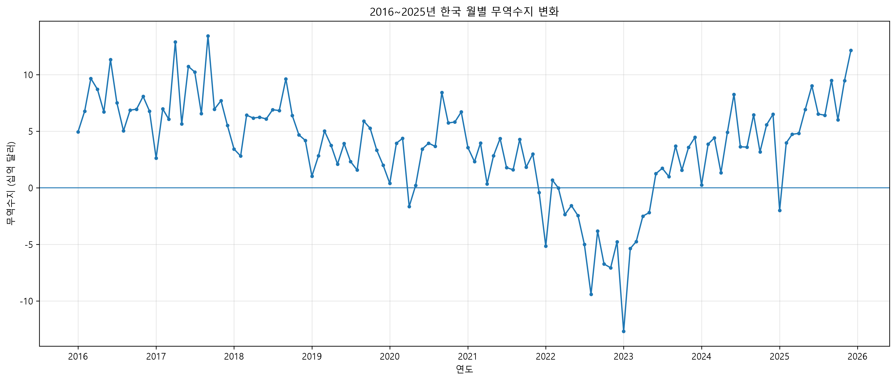

# 한국 월별 무역수지 트렌드 분석

## GitHub 저장소

본 프로젝트의 전체 코드와 분석 결과는 아래 GitHub 경로에서 확인할 수 있습니다.

https://github.com/bamiro00/codyssey-save/tree/main/M1-1

## 프로젝트 소개

2016년 1월부터 2025년 12월까지 한국의 월별 수출입 및 무역수지 데이터를 분석한 프로젝트입니다.

한국무역협회 K-stat 수출입 무역통계 데이터를 사용하여 다음 내용을 확인했습니다.

- 최근 10년간 월별 무역수지의 장기적인 흐름
- 12개월 이동평균을 활용한 추세 분석
- 연도별 흑자·적자 월 수 비교
- 이상치 후보 탐지
- 최대 흑자 및 최대 적자 시점 확인
- 2022~2023년 적자 구간과 이후 회복 흐름 분석

## 사용 데이터

- 출처: 한국무역협회 K-stat 수출입 무역통계
- 기간: 2016-01 ~ 2025-12
- 데이터 포인트: 120개
- 주요 컬럼:
  - 기준월
  - 연도
  - 월
  - 수출 금액
  - 수출 증감률
  - 수입 금액
  - 수입 증감률
  - 무역수지

## 프로젝트 파일

- `analysis.py` : 데이터 전처리, 분석, 시각화 코드
- `trade_data.xlsx` : 분석에 사용한 원본 통합 데이터
- `REPORT.md` : 분석 보고서
- `trade_balance_monthly.png` : 월별 무역수지 시각화
- `trade_balance_moving_average.png` : 12개월 이동평균 시각화
- `trade_balance_surplus_deficit_months.png` : 연도별 흑자·적자 월 수 시각화
- `requirements.txt` : 사용 라이브러리 목록

## 실행 환경

- Python 3.11 이상 (검증 환경: Python 3.12)
- VS Code
- 가상환경 사용 권장

## 실행 방법

### 1. 가상환경 생성

Windows 기준:

```bash
python -m venv .venv
```

### 2. 가상환경 활성화

PowerShell:

```powershell
.venv\Scripts\Activate.ps1
```

CMD:

```cmd
.venv\Scripts\activate
```

### 3. 필요한 라이브러리 설치

```bash
python -m pip install -r requirements.txt
```

### 4. 분석 실행

```bash
python analysis.py
```

분석을 실행하면 터미널에 데이터 기본 정보와 통계 결과가 출력되고, 시각화 이미지 파일이 생성됩니다.

## 주요 분석 방법

- 결측치 확인
- IQR 방식 이상치 후보 탐지
- 월별 무역수지 추세 분석
- 12개월 이동평균
- 연도별 흑자·적자 월 수 집계
- 연도별 월평균 무역수지 계산

## 주요 결과 요약

- 전체 120개월 중 흑자 월은 101개월, 적자 월은 19개월이었습니다.
- 2022년에는 12개월 중 11개월이 적자로 나타났습니다.
- 분석 기간 중 최대 적자는 2023년 1월에 나타났습니다.
- 2024년부터 무역수지가 다시 뚜렷한 흑자 흐름으로 회복되었습니다.
- 실제 데이터에서는 코로나19 초기보다 2022~2023년 적자 구간이 더 크게 나타났습니다.

## 보고서와 그래프

[분석 보고서](REPORT.md)



## 참고

자세한 분석 결과, 시각화 해석, 인사이트, 한계점, AI 사용 로그는 `REPORT.md`에서 확인할 수 있습니다.
