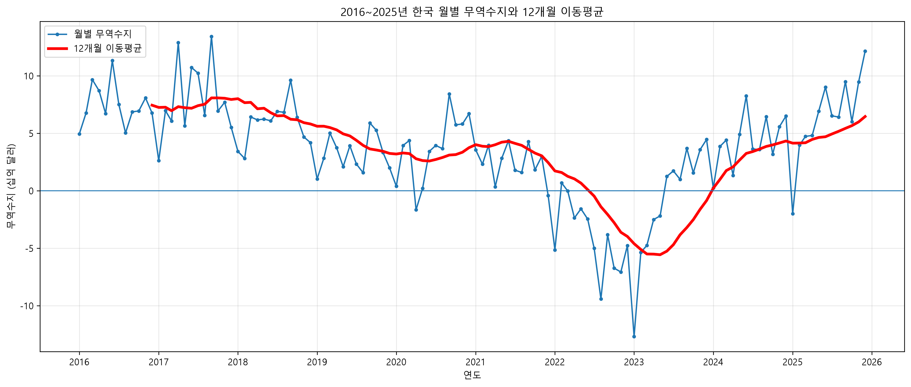
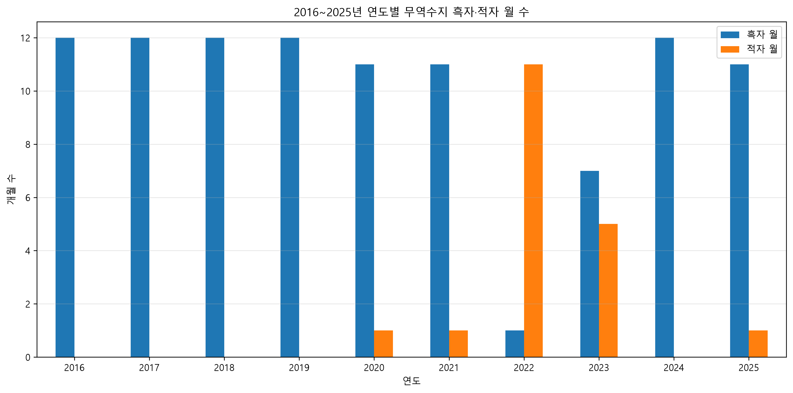

# 최근 10년간 한국 월별 무역수지의 변화와 트렌드 분석

## 1. 분석 주제

본 프로젝트에서는 2016년 1월부터 2025년 12월까지의 한국 월별 무역수지 데이터를 분석하였다.

무역수지는 수출액에서 수입액을 차감한 값으로, 국가의 무역흑자와 무역적자 상태를 확인할 수 있는 지표이다.

이번 분석에서는 단순히 무역수지의 증감만 확인하는 것이 아니라, 최근 10년 동안 무역수지가 어떤 장기적인 흐름을 보였는지, 적자가 집중된 시기는 언제였는지, 그리고 이후 어떤 회복 흐름이 나타났는지를 확인하는 것을 목적으로 하였다.

---

## 2. 분석 질문

이번 분석에서는 다음 3가지 질문을 설정하였다.

1. 2016년부터 2025년까지 한국의 월별 무역수지는 어떤 장기적인 추세를 보였는가?
2. 코로나19 시기를 포함하여 분석 기간 중 무역수지가 크게 변화한 시기는 언제였는가?
3. 무역수지가 장기간 적자를 기록한 시기와 이후 회복 과정은 어떻게 나타났는가?

---

## 3. 데이터 설명

- 데이터 출처: 한국무역협회 K-stat 수출입 무역통계
- 분석 기간: 2016년 1월 ~ 2025년 12월
- 데이터 개수: 120개
- 데이터 단위: 월별
- 금액 단위: US$
- 주요 컬럼
  - 기준월
  - 연도
  - 월
  - 원본 순번
  - 수출 금액
  - 수출 증감률
  - 수입 금액
  - 수입 증감률
  - 무역수지

분석에는 K-stat에서 내려받은 2016~2025년 월별 수출입 통합 데이터를 사용하였다.

---

## 4. 데이터 정제 및 검증

Python의 `pandas` 라이브러리를 이용하여 데이터를 불러오고 데이터의 기본 정보를 확인하였다.

데이터는 2016년 1월부터 2025년 12월까지 총 120개의 월별 데이터로 구성되어 있었으며, 분석에 필요한 기간이 모두 포함되어 있음을 확인하였다.

각 컬럼의 결측치를 확인한 결과 모든 컬럼에서 결측치는 0개로 나타났다.

### 4.1 이상치 확인

무역수지 값의 이상치 후보를 확인하기 위해 IQR(Interquartile Range) 방식을 사용하였다.

IQR 방식에서 계산된 기준은 다음과 같다.

- 하한: 약 -5.80십억 달러
- 상한: 약 13.88십억 달러

이 기준을 벗어난 이상치 후보는 다음 4개월이었다.

- 2022년 8월
- 2022년 10월
- 2022년 11월
- 2023년 1월

해당 값들은 실제 시계열에서 중요한 무역수지 변동을 나타내는 값이므로 임의로 삭제하지 않고 분석에 포함하였다.

---

## 5. 분석 방법

이번 분석에서는 다음과 같은 시계열 분석 방법을 적용하였다.

### 5.1 12개월 이동평균

월별 무역수지는 단기적인 변동이 크기 때문에 전체적인 장기 추세를 확인하기 위해 12개월 이동평균을 계산하였다.

12개월 이동평균은 현재 시점을 포함한 최근 12개월의 평균값을 계산하는 방식으로, 월별 변동을 완화하여 장기적인 상승·하락 흐름을 확인하기 위해 사용하였다.

### 5.2 연도별 집계 및 구간별 통계

각 연도별로 무역흑자를 기록한 월과 무역적자를 기록한 월의 개수를 계산하였다.

또한 각 연도의 월평균 무역수지를 계산하여 연도별 무역수지 수준을 비교하였다.

---

## 6. 시각화 결과

### 6.1 2016~2025년 한국 월별 무역수지 변화

월별 무역수지를 확인한 결과 2016년부터 2021년까지는 대부분의 기간에서 무역흑자가 유지되었다.

2020년에는 일부 월에서 무역적자가 나타났지만 이후 다시 흑자로 회복하였다.

반면 2022년에는 적자 구간이 길게 이어졌으며, 2023년 1월에는 분석 기간 중 가장 큰 월간 무역적자가 나타났다.

이후 2023년 중반부터 무역수지가 다시 개선되었고 2024년과 2025년에는 대부분의 월에서 흑자 흐름이 나타났다.

---

### 6.2 월별 무역수지와 12개월 이동평균

월별 무역수지와 12개월 이동평균을 함께 비교하였다.

월별 데이터는 단기적으로 큰 폭으로 변동하지만, 이동평균선을 통해 장기적인 흐름을 보다 쉽게 확인할 수 있었다.

이동평균은 2017년 이후 전반적으로 낮아지는 흐름을 보였으며, 2022년 이후 빠르게 감소하여 2023년에는 적자 영역까지 내려갔다.

이후 이동평균이 다시 상승하면서 2024년에 흑자 영역으로 회복하였고, 2025년에도 상승 흐름이 이어졌다.

---

### 6.3 연도별 무역수지 흑자·적자 월 수

연도별 흑자·적자 월 수를 계산한 결과는 다음과 같다.

| 연도 | 흑자 월 | 적자 월 |
|---|---:|---:|
| 2016 | 12 | 0 |
| 2017 | 12 | 0 |
| 2018 | 12 | 0 |
| 2019 | 12 | 0 |
| 2020 | 11 | 1 |
| 2021 | 11 | 1 |
| 2022 | 1 | 11 |
| 2023 | 7 | 5 |
| 2024 | 12 | 0 |
| 2025 | 11 | 1 |

2016년부터 2019년까지는 모든 월에서 무역흑자를 기록하였다.

2020년과 2021년에는 각각 1개월만 적자를 기록하였다.

반면 2022년에는 12개월 중 11개월이 적자를 기록하여 분석 기간 중 적자 월이 가장 집중된 연도로 나타났다.

2023년에는 흑자 7개월, 적자 5개월로 적자 월 수가 줄었고, 2024년에는 다시 12개월 모두 흑자를 기록하였다.

---

## 7. 주요 인사이트

### 인사이트 1. 장기적으로 흑자 규모가 축소되는 흐름이 나타난 뒤 2022년에 큰 변화가 발생하였다.

연도별 월평균 무역수지를 계산한 결과는 다음과 같다.

| 연도 | 월평균 무역수지(십억 달러) |
|---|---:|
| 2016 | 7.44 |
| 2017 | 7.93 |
| 2018 | 5.80 |
| 2019 | 3.24 |
| 2020 | 3.74 |
| 2021 | 2.44 |
| 2022 | -3.98 |
| 2023 | -0.86 |
| 2024 | 4.32 |
| 2025 | 6.45 |

**관찰:** 2016~2021년에는 연평균 기준으로 계속 흑자였지만, 2017년 이후 흑자 규모가 전반적으로 축소되는 흐름이 나타났다.

**해석:** 2022년의 큰 적자 전환 이전부터 무역수지의 흑자 폭이 축소되는 변화가 관찰되었다. 다만 이 데이터만으로 흑자 폭 축소의 원인을 직접 설명할 수는 없다.

---

### 인사이트 2. 가장 뚜렷한 무역수지 악화는 코로나19 초기보다 2022년에 나타났다.

2022년의 월평균 무역수지는 약 -3.98십억 달러였으며, 12개월 중 11개월이 적자를 기록하였다.

또한 2023년 1월에는 약 -12.70십억 달러로 분석 기간 중 가장 큰 월간 무역적자를 기록하였다.

**관찰:** 2020년과 2021년에는 각각 1개월만 적자를 기록한 반면, 2022년에는 11개월이 적자였다.

**해석:** 초기에는 코로나19 시기에 가장 큰 무역수지 악화가 나타날 것으로 예상했지만, 실제 데이터에서는 2022년의 적자 장기화가 더 뚜렷하게 나타났다.

관세청의 2022년 확정 통계에 따르면 2022년 수출은 전년 대비 6.1% 증가했지만 수입은 18.9% 증가하였고, 연간 무역수지는 474.67억 달러 적자를 기록하였다. 따라서 2022년 적자는 단순히 수출 감소만으로 설명하기보다 수입 증가가 더 크게 나타났다는 점을 함께 고려할 필요가 있다.

---

### 인사이트 3. 2023년을 거쳐 2024~2025년에 무역수지가 회복되는 흐름이 확인되었다.

연도별 월평균 무역수지는 다음과 같이 변화하였다.

- 2022년: -3.98십억 달러
- 2023년: -0.86십억 달러
- 2024년: +4.32십억 달러
- 2025년: +6.45십억 달러

**관찰:** 2022년의 큰 적자 이후 2023년에는 적자 폭이 감소하였으며, 2024년부터 다시 월평균 무역수지가 흑자로 전환되었다.

**해석:** 무역수지는 한 번에 회복된 것이 아니라 2023년을 거쳐 점진적으로 개선된 흐름으로 볼 수 있다.

---

## 8. 결론

2016년부터 2025년까지 한국의 월별 무역수지를 분석한 결과, 분석 기간 대부분에서는 무역흑자가 나타났지만 특정 시기에 큰 변화가 발생하였다.

2016년부터 2021년까지는 대부분의 월에서 흑자가 유지되었으나, 2017년 이후 장기적으로 흑자 규모가 줄어드는 흐름이 나타났다.

특히 2022년에는 12개월 중 11개월이 무역적자를 기록하면서 분석 기간 중 가장 뚜렷한 무역수지 악화가 나타났다.

2023년에는 적자 폭이 감소하였으며, 2024년부터 다시 흑자로 회복되었다. 12개월 이동평균에서도 2022~2023년의 하락과 이후 회복 흐름을 확인할 수 있었다.

이번 분석을 통해 특정 사건만을 기준으로 결과를 예상하기보다 실제 데이터를 통해 변화 시점과 규모를 확인하고, 관찰 결과와 원인에 대한 해석을 구분하는 것이 중요하다는 점을 확인하였다.

---

## 9. 한계점

이번 분석에는 다음과 같은 한계가 있다.

첫째, 무역수지의 변화 자체를 중심으로 분석하였기 때문에 변화의 원인을 직접적으로 증명할 수 없다.

둘째, 환율, 국제 원자재 가격, 에너지 가격, 세계 경기, 주요 교역국의 경제 상황 등 무역수지에 영향을 줄 수 있는 외부 변수를 함께 분석하지 않았다.

셋째, 월별 총액 데이터를 사용하였기 때문에 품목별·국가별 세부 변화를 확인하기 어렵다.

따라서 향후 분석에서는 수출액과 수입액의 변화를 별도로 비교하거나 환율, 에너지 수입액, 주요 수출 품목 등의 데이터를 함께 분석하면 무역수지 변화의 원인을 보다 구체적으로 확인할 수 있다.

---

## 10. AI 사용 로그

### 10.1 AI를 사용한 작업

AI를 다음 작업에 활용하였다.

- 분석 주제 및 분석 질문 구체화
- Python 코드 작성 보조
- `pandas`를 이용한 데이터 확인 및 결측치 점검 방법 탐색
- IQR 방식의 이상치 탐지 코드 작성 보조
- 12개월 이동평균 계산 방법 확인
- `matplotlib`을 이용한 시각화 코드 작성 및 수정
- 분석 결과의 관찰과 해석 구분
- 보고서 문장 구성 및 정리

### 10.2 AI를 사용한 이유

Python과 데이터 분석에 익숙하지 않아 코드 작성 과정에서 발생할 수 있는 오류를 줄이고, 각 분석 방법의 의미를 이해하면서 과제를 진행하기 위해 AI를 활용하였다.

또한 분석 결과를 어떤 방식으로 설명할 수 있는지 여러 가능성을 검토하고 보고서의 문장을 정리하는 데 활용하였다.

### 10.3 AI 결과 검증 방법

AI가 제안한 코드를 그대로 제출하지 않고 VS Code에서 직접 실행하여 결과를 확인하였다.

다음 항목을 Python으로 직접 출력하고 원본 데이터 및 그래프와 비교하였다.

- 데이터 개수 120개 확인
- 결측치 0개 확인
- 데이터 기간 확인
- 최대 흑자·최대 적자 월 확인
- IQR 기준 이상치 후보 확인
- 연도별 흑자·적자 월 수 확인
- 연도별 월평균 무역수지 확인
- 12개월 이동평균 시각화 결과 확인

또한 처음에는 코로나19 시기에 가장 큰 무역수지 악화가 나타날 것으로 예상했지만, 실제 분석 결과 2022년에 더 큰 적자 구간이 나타나는 것을 확인하고 실제 데이터 결과를 기준으로 분석 방향을 수정하였다.

---

## 11. 참고 자료

1. 한국무역협회 K-stat 수출입 무역통계  
   https://stat.kita.net/

2. 관세청, 「2022년 12월 월간 수출입 현황 [확정치]」  
   https://www.customs.go.kr/kcs/na/ntt/selectNttInfo.do?mi=2891&nttSn=10072075

3. 분석 데이터  
   2016년 1월 ~ 2025년 12월 한국 월별 수출입·무역수지 자료
