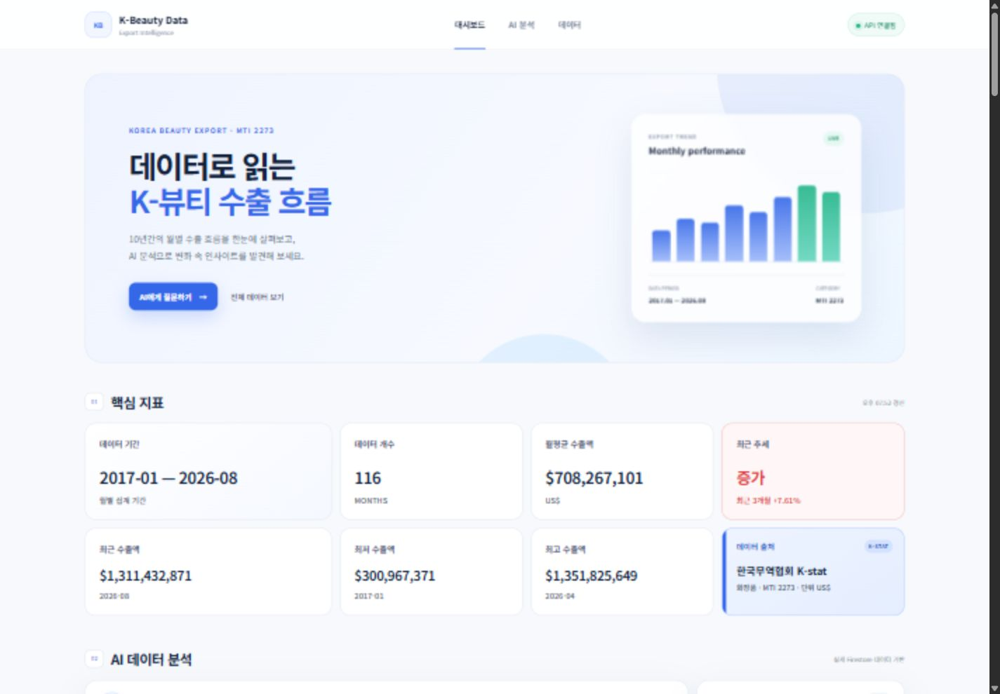
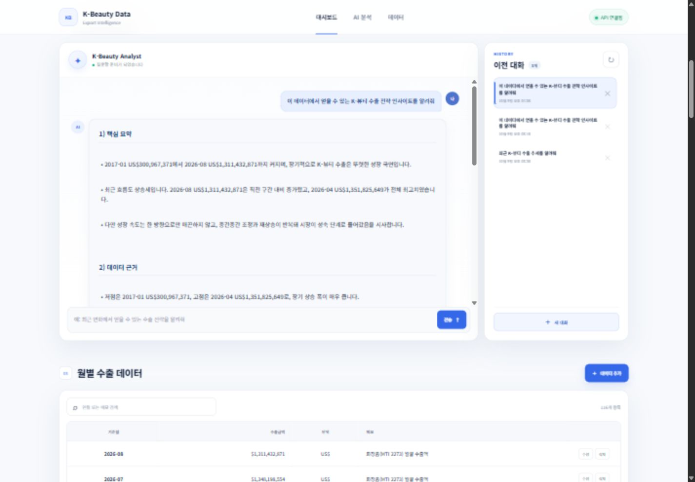
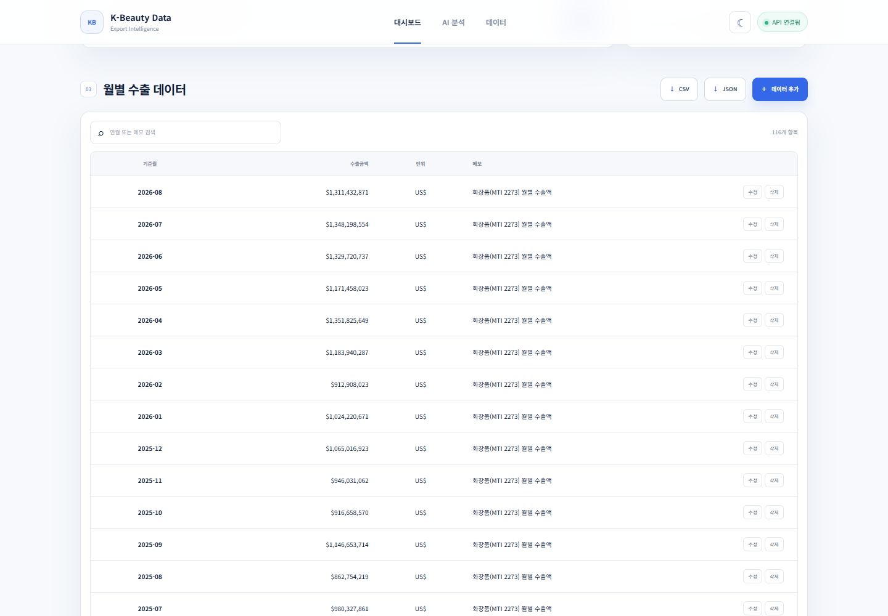
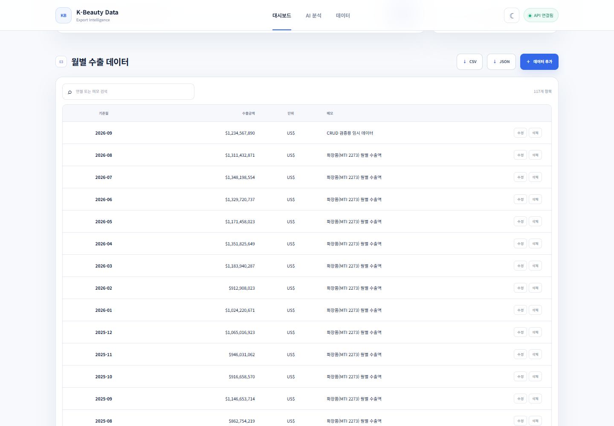
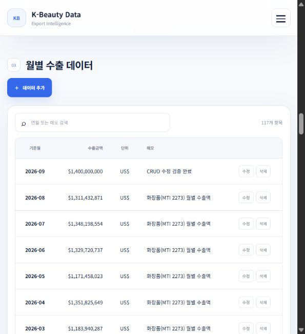
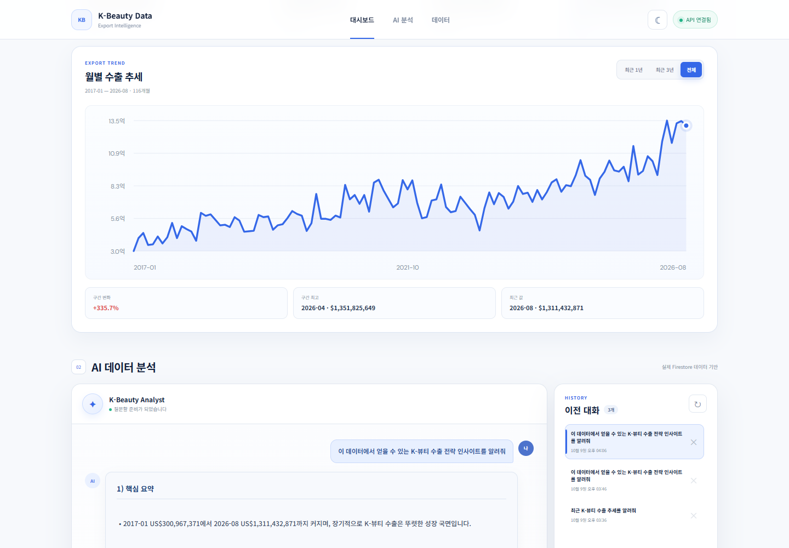
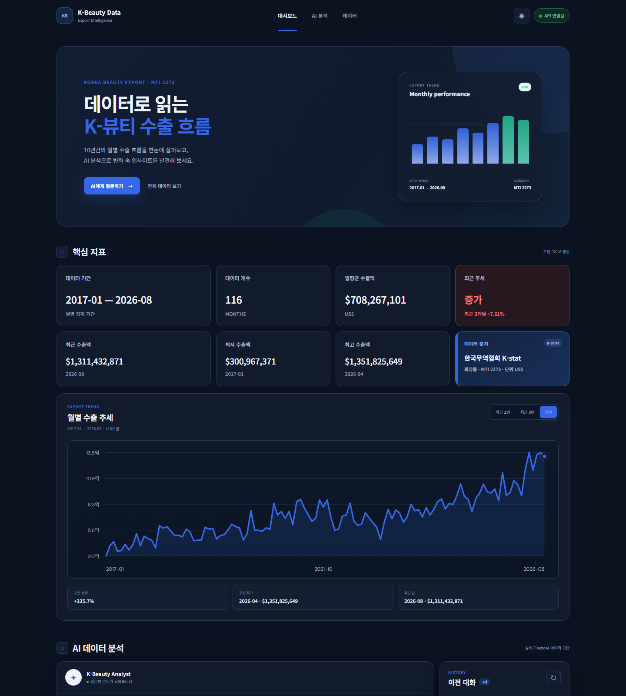
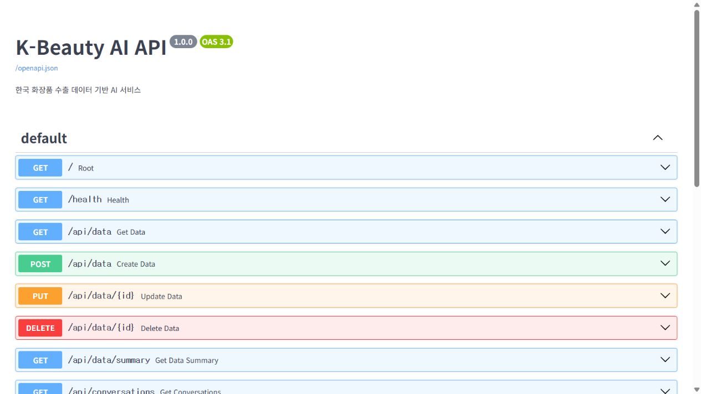
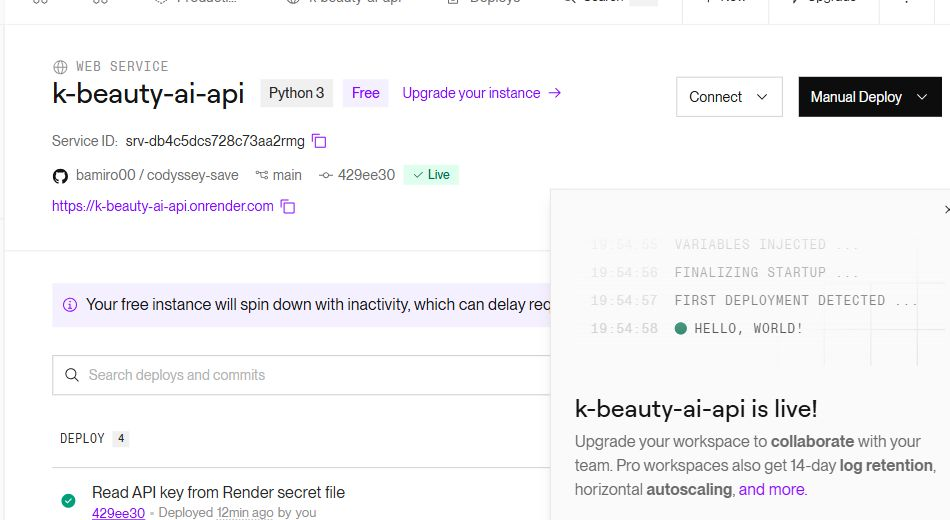
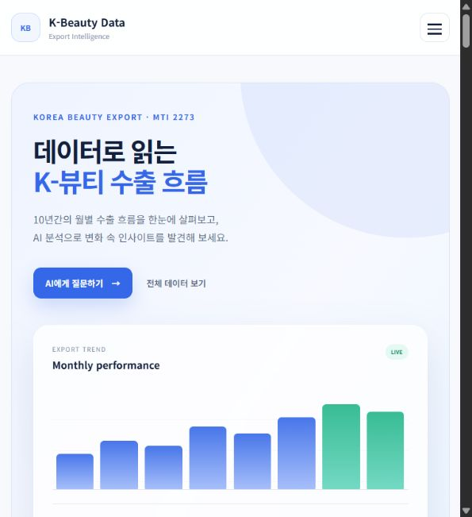

# K-Beauty Data

한국 화장품 월별 수출 데이터를 Firestore에 저장하고, 실제 데이터와 요약 통계를 바탕으로 AI가 질문에 답하는 웹 애플리케이션입니다.

## 서비스 목적

월별 수출액 표만으로는 장기적인 변화와 최근 흐름을 빠르게 파악하기 어렵습니다. 이 서비스는 핵심 지표, 월별 데이터 관리, AI 분석과 이전 대화 기록을 하나의 화면에서 제공합니다.

## 배포 주소

- Frontend: https://kbeauty-analytics.vercel.app
- Backend API: https://kbeauty-analytics.vercel.app/api
- Health Check: https://kbeauty-analytics.vercel.app/health
- Swagger: https://kbeauty-analytics.vercel.app/docs

## 데이터

- 출처: 한국무역협회 K-stat 수출입 무역통계
- 품목: 화장품
- MTI 코드: 2273
- 기간: 2017-01 ~ 2026-08
- 개수: 116개
- 주기: 월별
- 지표: 수출금액
- 단위: US$

## 주요 기능

- 데이터 기간·개수·평균·최댓값·최솟값·최근 값·최근 추세 표시
- 실제 116개월 데이터를 이용한 수출 추세 선 그래프와 최근 1년·3년·전체 기간 전환
- 월별 수출 데이터 검색
- 전체 월별 데이터를 최신순 CSV·JSON 파일로 내보내기
- 데이터 추가·수정·삭제
- 실제 Firestore 데이터를 근거로 한 AI 분석
- 질문과 AI 답변 자동 저장
- 이전 대화 목록 조회·불러오기·삭제
- 라이트·다크 모드 전환 및 선택 상태 저장
- 입력값 검증과 이해하기 쉬운 오류 메시지

## 주요 기능 사용 방법

### AI에게 데이터 질문하기

1. 배포된 프런트엔드에 접속합니다.
2. `AI 데이터 분석` 영역에서 추천 질문을 누르거나 질문을 직접 입력합니다.
3. `전송`을 누르면 Firestore에 저장된 실제 월별 수출 데이터와 요약 통계를 바탕으로 답변합니다.
4. 서버가 처음 깨어나는 경우 응답 준비에 최대 1분 정도 걸릴 수 있습니다.

### 이전 대화 확인하기

- 오른쪽 `이전 대화`에서 항목을 선택하면 저장된 질문과 답변 전체를 다시 불러옵니다.
- `새 대화`를 누르면 현재 화면을 비우고 새로운 질문을 시작합니다.
- 각 항목의 `×` 버튼을 누르면 확인 후 해당 대화만 삭제합니다.

### 월별 데이터 관리하기

- `데이터 추가`에서 기준월, 수출금액, 메모를 입력해 새 데이터를 저장합니다.
- 표 오른쪽의 `수정`과 `삭제` 버튼으로 각 월의 데이터를 관리합니다.
- 이미 존재하는 기준월은 중복으로 추가할 수 없습니다.
- 검색창에 `YYYY-MM` 또는 메모 일부를 입력하면 해당 데이터만 표시됩니다.

### 그래프와 파일 내보내기

- `월별 수출 추세`의 `최근 1년`, `최근 3년`, `전체` 버튼으로 그래프 표시 기간을 바꿉니다.
- 데이터 영역의 `CSV` 또는 `JSON`을 누르면 116개월 데이터가 최신순으로 저장됩니다.

### 화면 테마 바꾸기

- 화면 오른쪽 위의 달 또는 해 버튼으로 라이트·다크 모드를 전환합니다.
- 선택한 화면 모드는 브라우저에 저장되어 새로고침 후에도 유지됩니다.

## 화면 미리보기

### 메인 대시보드

배포된 서비스의 핵심 지표, 데이터 출처, API 연결 상태를 한 화면에서 확인할 수 있습니다.



### 실제 데이터 기반 AI 분석과 이전 대화

사용자의 질문과 AI 답변을 표시하며, 오른쪽 목록에서 Firestore에 저장된 이전 대화를 다시 불러올 수 있습니다.



### 데이터 CRUD 검증

검증용 `2026-09` 데이터를 추가·수정·삭제한 뒤 원래 116개 데이터 상태로 복구했습니다.

| 검증 전: 116개 | 추가 후: 117개 |
|---|---|
|  |  |

| 수정 후 | 삭제 후: 116개 복구 |
|---|---|
|  |  |

### 실제 116개월 수출 추세 그래프

Firestore에서 조회한 월별 데이터를 사용하며 최근 1년·3년·전체 기간을 선택할 수 있습니다.



### 다크 모드

대시보드, 핵심 지표, 그래프, AI 대화와 데이터 표에 다크 모드를 적용하며 선택 상태를 저장합니다.



### API 및 배포 확인

FastAPI Swagger에서 필수 API를 확인할 수 있고, Render 백엔드와 Vercel 프런트엔드에 배포했습니다.



| Render 백엔드 | Vercel 프런트엔드 |
|---|---|
|  |  |

## 사용 기술

- Backend: Python, FastAPI, Uvicorn, Pydantic
- Database: Firebase Firestore
- AI: Codyssey OpenAI 호환 API, GPT-5.4 mini
- Frontend: HTML, CSS, JavaScript
- Deployment: Render, Vercel

## 프로젝트 구조

```text
K-beauty_AI/
├─ docs/
│  └─ images/
│     └─ README 화면 캡처
├─ frontend/
│  ├─ index.html
│  ├─ styles.css
│  ├─ highlight-overrides.css
│  ├─ config.js
│  └─ app.js
├─ main.py
├─ firebase_config.py
├─ openai_config.py
├─ upload_data.py
├─ test_openai.py
├─ requirements.txt
├─ .env.example
└─ README.md
```

`.env`, Firebase 서비스 계정 파일, 가상환경과 캐시 파일은 Git에 포함되지 않습니다.

## 설치 방법

Python 3.10 이상이 필요합니다.

```bash
python -m venv venv
```

Windows PowerShell:

```powershell
.\venv\Scripts\Activate.ps1
pip install -r requirements.txt
```

## 환경변수

`.env.example`을 참고해 프로젝트 루트에 `.env` 파일을 만듭니다.

```env
OPENAI_API_KEY=
OPENAI_BASE_URL=https://copa.codyssey.kr/v1
OPENAI_MODEL=gpt-5.4-mini
FIREBASE_SERVICE_ACCOUNT_PATH=firebase-key.json
FIREBASE_SERVICE_ACCOUNT_JSON=
ALLOWED_ORIGINS=http://127.0.0.1:5500,http://localhost:5500
```

실제 API 키와 Firebase 인증정보는 README나 GitHub에 올리지 않습니다.

로컬에서는 `FIREBASE_SERVICE_ACCOUNT_PATH`를 사용합니다. Render에서는
`FIREBASE_SERVICE_ACCOUNT_JSON` 환경변수 또는 `/etc/secrets/firebase-key.json`
Secret File 방식을 사용할 수 있습니다. 현재 배포는 `.env`와
`firebase-key.json`을 Render Secret Files로 관리합니다.

## 로컬 실행

백엔드 실행:

```powershell
uvicorn main:app --reload
```

- API 기본 주소: `http://127.0.0.1:8000`
- Swagger: `http://127.0.0.1:8000/docs`

프론트엔드는 `frontend/index.html`을 열어 사용할 수 있습니다. 로컬 API 주소는 `frontend/config.js`에서 관리합니다.

## Firestore 구조

### `data`

```json
{
  "date": "2026-08",
  "value": 1311432871,
  "memo": "화장품(MTI 2273) 월별 수출액",
  "unit": "US$"
}
```

### `conversations`

```json
{
  "title": "질문 제목",
  "created_at": "ISO 8601 datetime",
  "updated_at": "ISO 8601 datetime",
  "messages": [
    {"role": "user", "content": "사용자 질문"},
    {"role": "assistant", "content": "AI 답변"}
  ]
}
```

## API

| Method | Endpoint | 설명 |
|---|---|---|
| GET | `/health` | 배포 서버 상태 확인 |
| GET | `/api/data` | 데이터 목록 조회 |
| POST | `/api/data` | 데이터 추가 |
| PUT | `/api/data/{id}` | 데이터 수정 |
| DELETE | `/api/data/{id}` | 데이터 삭제 |
| GET | `/api/data/summary` | 데이터 요약 조회 |
| POST | `/api/chat` | 실제 데이터 기반 AI 질문 |
| GET | `/api/conversations` | 대화 목록 조회 |
| GET | `/api/conversations/{id}` | 특정 대화 불러오기 |
| POST | `/api/conversations` | 대화 저장 |
| DELETE | `/api/conversations/{id}` | 대화 삭제 |

## AI가 실제 데이터를 사용하는 방식

1. 사용자의 질문을 검사합니다.
2. Firestore에서 116개의 월별 수출 데이터를 조회합니다.
3. 기간, 평균, 최댓값, 최솟값, 최근 값과 최근 추세를 계산합니다.
4. 요약과 실제 월별 값을 AI 컨텍스트에 전달합니다.
5. AI는 제공된 데이터 안에서만 한국어 답변을 생성합니다.
6. 데이터만으로 확인할 수 없는 원인은 가능성 또는 추가 확인 필요로 구분합니다.
7. 질문과 답변을 `conversations` 컬렉션에 자동 저장합니다.

## 알려진 제한사항

- 무료 백엔드 서버는 처음 접속할 때 준비에 최대 1분 정도 걸릴 수 있습니다.
- 현재 데이터만으로 국가별·품목별·채널별 원인을 확정할 수 없습니다.
- AI의 외부 시장 해석은 사실이 아니라 가능성으로 구분합니다.
- 동일한 질문도 표현이 조금 달라질 수 있으나 낮은 변동성 설정으로 편차를 줄였습니다.

