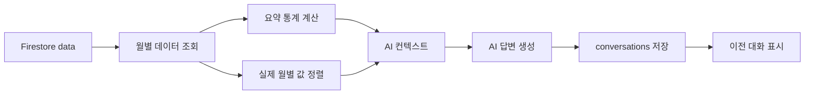

# K-Beauty Data

한국 화장품 월별 수출 데이터를 Firestore에 저장하고, 실제 데이터와 요약 통계를 바탕으로 AI가 질문에 답하는 웹 애플리케이션입니다.

## 서비스 목적

월별 수출액 표만으로는 장기적인 변화와 최근 흐름을 빠르게 파악하기 어렵습니다. 이 서비스는 핵심 지표, 월별 데이터 관리, AI 분석과 이전 대화 기록을 하나의 화면에서 제공합니다.

## 배포 주소

- Frontend: https://kbeauty-analytics.vercel.app
- Backend API: https://kbeauty-analytics.vercel.app/api
- Health Check: https://kbeauty-analytics.vercel.app/health
- Swagger: https://kbeauty-analytics.vercel.app/docs

## 데이터

- 출처: 한국무역협회 K-stat 수출입 무역통계
- 품목: 화장품
- MTI 코드: 2273
- 기간: 2017-01 ~ 2026-08
- 개수: 116개
- 주기: 월별
- 지표: 수출금액
- 단위: US$

## 주요 기능

- 데이터 기간·개수·평균·최댓값·최솟값·최근 값·최근 추세 표시
- 실제 116개월 데이터를 이용한 수출 추세 선 그래프와 최근 1년·3년·전체 기간 전환
- 월별 수출 데이터 검색
- 전체 월별 데이터를 최신순 CSV·JSON 파일로 내보내기
- 데이터 추가·수정·삭제
- 실제 Firestore 데이터를 근거로 한 AI 분석
- 질문과 AI 답변 자동 저장
- 이전 대화 목록 조회·불러오기·삭제
- 라이트·다크 모드 전환 및 선택 상태 저장
- 입력값 검증과 이해하기 쉬운 오류 메시지

## 주요 기능 사용 방법

### AI에게 데이터 질문하기

1. 배포된 프런트엔드에 접속합니다.
2. `AI 데이터 분석` 영역에서 추천 질문을 누르거나 질문을 직접 입력합니다.
3. `전송`을 누르면 Firestore에 저장된 실제 월별 수출 데이터와 요약 통계를 바탕으로 답변합니다.
4. 서버가 처음 깨어나는 경우 응답 준비에 최대 1분 정도 걸릴 수 있습니다.

### 이전 대화 확인하기

- 오른쪽 `이전 대화`에서 항목을 선택하면 저장된 질문과 답변 전체를 다시 불러옵니다.
- `새 대화`를 누르면 현재 화면을 비우고 새로운 질문을 시작합니다.
- 각 항목의 `×` 버튼을 누르면 확인 후 해당 대화만 삭제합니다.

### 월별 데이터 관리하기

- `데이터 추가`에서 기준월, 수출금액, 메모를 입력해 새 데이터를 저장합니다.
- 표 오른쪽의 `수정`과 `삭제` 버튼으로 각 월의 데이터를 관리합니다.
- 이미 존재하는 기준월은 중복으로 추가할 수 없습니다.
- 검색창에 `YYYY-MM` 또는 메모 일부를 입력하면 해당 데이터만 표시됩니다.

### 그래프와 파일 내보내기

- `월별 수출 추세`의 `최근 1년`, `최근 3년`, `전체` 버튼으로 그래프 표시 기간을 바꿉니다.
- 데이터 영역의 `CSV` 또는 `JSON`을 누르면 116개월 데이터가 최신순으로 저장됩니다.

### 화면 테마 바꾸기

- 화면 오른쪽 위의 달 또는 해 버튼으로 라이트·다크 모드를 전환합니다.
- 선택한 화면 모드는 브라우저에 저장되어 새로고침 후에도 유지됩니다.

## 화면 미리보기

### 메인 대시보드

배포된 서비스의 핵심 지표, 데이터 출처, API 연결 상태를 한 화면에서 확인할 수 있습니다.


### 실제 데이터 기반 AI 분석과 이전 대화

사용자의 질문과 AI 답변을 표시하며, 오른쪽 목록에서 Firestore에 저장된 이전 대화를 다시 불러올 수 있습니다.


### 데이터 CRUD 검증

검증용 `2026-09` 데이터를 추가·수정·삭제한 뒤 원래 116개 데이터 상태로 복구했습니다.

| 검증 전: 116개 | 추가 후: 117개 |
|---|---|
|  |  |

| 수정 후 | 삭제 후: 116개 복구 |
|---|---|
|  |  |

### 실제 116개월 수출 추세 그래프

Firestore에서 조회한 월별 데이터를 사용하며 최근 1년·3년·전체 기간을 선택할 수 있습니다.


### 다크 모드

대시보드, 핵심 지표, 그래프, AI 대화와 데이터 표에 다크 모드를 적용하며 선택 상태를 저장합니다.


### API 및 배포 확인

FastAPI Swagger에서 필수 API를 확인할 수 있고, Render 백엔드와 Vercel 프런트엔드에 배포했습니다.


| Render 백엔드 | Vercel 프런트엔드 |
|---|---|
|  |  |

## 사용 기술

- Backend: Python, FastAPI, Uvicorn, Pydantic
- Database: Firebase Firestore
- AI: Codyssey OpenAI 호환 API, GPT-5.4 mini
- Frontend: HTML, CSS, JavaScript
- Deployment: Render, Vercel

## 프로젝트 구조

```text
K-beauty_AI/
├─ docs/
│  └─ images/
│     └─ README 화면 캡처
├─ frontend/
│  ├─ index.html
│  ├─ styles.css
│  ├─ highlight-overrides.css
│  ├─ config.js
│  └─ app.js
├─ main.py
├─ firebase_config.py
├─ openai_config.py
├─ upload_data.py
├─ test_openai.py
├─ requirements.txt
├─ .env.example
└─ README.md
```

`.env`, Firebase 서비스 계정 파일, 가상환경과 캐시 파일은 Git에 포함되지 않습니다.

### 백엔드 책임 분리 설계

현재 과제는 배포 단순성과 작은 규모를 고려해 FastAPI 엔드포인트를 `main.py`에 모아 두었지만, 코드 안에서는 데이터·요약·대화·AI 영역을 독립된 엔드포인트 블록으로 구분했습니다. 프로젝트가 커질 때는 아래 기준으로 파일을 분리합니다.

| 계층 | 책임 | 분리 시 파일 예시 |
|---|---|---|
| Router | URL, 요청 수신, HTTP 상태 코드와 응답 형식 | `routers/data.py`, `routers/conversations.py`, `routers/chat.py` |
| Service | Firestore 조회·저장, 통계 계산, AI 컨텍스트 생성 | `services/data_service.py`, `services/summary_service.py`, `services/chat_service.py` |
| Schema | 요청 데이터 형식과 입력 검증 | `schemas/data.py`, `schemas/conversation.py`, `schemas/chat.py` |
| Infrastructure | 외부 서비스 연결과 비밀정보 로딩 | `firebase_config.py`, `openai_config.py` |

Router는 입력을 받아 Service를 호출하고, Service는 특정 HTTP 프레임워크에 의존하지 않는 업무 로직만 담당합니다. Schema는 Router 진입 전에 잘못된 요청을 차단합니다. 이 기준을 사용하면 통계 계산을 대시보드와 AI에서 재사용하고, 각 계층을 독립적으로 테스트할 수 있습니다.

```text
Browser → FastAPI Router → Service → Firestore / AI API
                    ↑
              Pydantic Schema
```

## 설치 방법

Python 3.10 이상이 필요합니다.

```bash
python -m venv venv
```

Windows PowerShell:

```powershell
.\venv\Scripts\Activate.ps1
pip install -r requirements.txt
```

## 환경변수

`.env.example`을 참고해 프로젝트 루트에 `.env` 파일을 만듭니다.

```env
OPENAI_API_KEY=
OPENAI_BASE_URL=https://copa.codyssey.kr/v1
OPENAI_MODEL=gpt-5.4-mini
FIREBASE_SERVICE_ACCOUNT_PATH=firebase-key.json
FIREBASE_SERVICE_ACCOUNT_JSON=
ALLOWED_ORIGINS=http://127.0.0.1:5500,http://localhost:5500
```

실제 API 키와 Firebase 인증정보는 README나 GitHub에 올리지 않습니다.

로컬에서는 `FIREBASE_SERVICE_ACCOUNT_PATH`를 사용합니다. Render에서는
`FIREBASE_SERVICE_ACCOUNT_JSON` 환경변수 또는 `/etc/secrets/firebase-key.json`
Secret File 방식을 사용할 수 있습니다. 현재 배포는 `.env`와
`firebase-key.json`을 Render Secret Files로 관리합니다.

### 배포 환경변수와 CORS 설정

- Render의 `Environment`에 `OPENAI_API_KEY`, `OPENAI_BASE_URL`, `OPENAI_MODEL`, `ALLOWED_ORIGINS`를 등록합니다.
- Firebase 인증정보는 Render의 `Secret File` 또는 `FIREBASE_SERVICE_ACCOUNT_JSON`으로 등록합니다.
- Vercel 프런트엔드는 `frontend/config.js`에 공개 API 기본 주소만 사용하며 비밀키를 포함하지 않습니다.
- 환경변수를 변경한 뒤에는 해당 서비스를 재배포해야 새 값이 적용됩니다.
- 운영 환경의 `ALLOWED_ORIGINS`에는 실제 프런트엔드 주소만 허용하고 `*`는 사용하지 않는 것을 원칙으로 합니다.

```env
ALLOWED_ORIGINS=https://kbeauty-analytics.vercel.app,http://127.0.0.1:5500,http://localhost:5500
```

로컬 주소는 개발용이고 `https://kbeauty-analytics.vercel.app`은 운영용입니다. 허용 출처를 최소화해 임의의 외부 사이트가 브라우저에서 API를 호출하는 범위를 줄입니다.

## 로컬 실행

백엔드 실행:

```powershell
uvicorn main:app --reload
```

- API 기본 주소: `http://127.0.0.1:8000`
- Swagger: `http://127.0.0.1:8000/docs`

프론트엔드는 `frontend/index.html`을 열어 사용할 수 있습니다. 로컬 API 주소는 `frontend/config.js`에서 관리합니다.

## Firestore 구조

### `data`

```json
{
  "date": "2026-08",
  "value": 1311432871,
  "memo": "화장품(MTI 2273) 월별 수출액",
  "unit": "US$"
}
```

### `conversations`

```json
{
  "title": "질문 제목",
  "created_at": "ISO 8601 datetime",
  "updated_at": "ISO 8601 datetime",
  "messages": [
    {"role": "user", "content": "사용자 질문"},
    {"role": "assistant", "content": "AI 답변"}
  ]
}
```

### 컬렉션 설계와 인덱스

| 컬렉션 | 문서 ID | 설계 이유 | 주요 조회 방식 |
|---|---|---|---|
| `data` | `YYYY-MM` | 월별 데이터의 자연 키를 사용해 같은 월의 중복 저장을 문서 ID 수준에서 방지 | 전체 조회 후 `date` 기준 정렬 |
| `conversations` | Firestore 자동 ID | 여러 대화를 독립적으로 저장하고 생성 시점 충돌을 방지 | 전체 조회 후 `created_at` 내림차순 정렬 |

현재 데이터는 116개의 월별 레코드로 작고 복합 조건 쿼리를 사용하지 않아 별도의 복합 인덱스가 필요하지 않습니다. 데이터가 커지면 서버에서 `order_by`와 `limit`을 사용해 페이지네이션하고, `conversations.created_at` 단일 필드 인덱스를 활용합니다. 향후 국가·품목·채널 필드를 추가해 복합 필터와 정렬을 함께 사용하면 해당 조합에 맞는 Firestore 복합 인덱스를 생성합니다.

### Pydantic 스키마와 검증 규칙

| 스키마 | 목적 | 주요 검증 규칙 |
|---|---|---|
| `DataItem` | 월별 수출 데이터 추가·수정 | `date`는 `YYYY-MM`, `value`는 0 이상의 정수, `unit`은 `US$`, `memo`는 최대 200자 |
| `Message` | 저장되는 대화 메시지 | `role`은 `user` 또는 `assistant`, 내용은 1~12,000자 |
| `ConversationCreate` | 질문과 답변 묶음 저장 | 제목은 최대 80자, 메시지는 1~20개 |
| `ChatRequest` | AI 질문 요청 | 공백 제거 후 1~1,000자 |

문자열은 앞뒤 공백을 제거하며 줄바꿈·탭을 제외한 제어문자를 거부합니다. 프런트엔드에서는 화면에 출력하기 전에 HTML 특수문자를 이스케이프해 저장된 문자열이 HTML로 실행되지 않도록 합니다.

## API

| Method | Endpoint | 설명 |
|---|---|---|
| GET | `/health` | 배포 서버 상태 확인 |
| GET | `/api/data` | 데이터 목록 조회 |
| POST | `/api/data` | 데이터 추가 |
| PUT | `/api/data/{id}` | 데이터 수정 |
| DELETE | `/api/data/{id}` | 데이터 삭제 |
| GET | `/api/data/summary` | 데이터 요약 조회 |
| POST | `/api/chat` | 실제 데이터 기반 AI 질문 |
| GET | `/api/conversations` | 대화 목록 조회 |
| GET | `/api/conversations/{id}` | 특정 대화 불러오기 |
| POST | `/api/conversations` | 대화 저장 |
| DELETE | `/api/conversations/{id}` | 대화 삭제 |

### Health Check 응답

`GET /health`는 프런트엔드와 운영자가 백엔드 준비 상태를 확인할 때 사용합니다.

```json
{
  "status": "ok",
  "service": "K-Beauty AI API"
}
```

### 요약 엔드포인트를 분리한 이유

`GET /api/data`는 원본 월별 목록을 반환하고, `GET /api/data/summary`는 대시보드와 AI가 사용하는 집계 결과만 반환합니다. 목록 조회와 통계 계산을 분리하면 프런트엔드는 필요한 결과를 독립적으로 요청할 수 있고, 동일한 통계 규칙을 여러 화면에서 재사용할 수 있습니다. 또한 전체 원본 응답 형식이 바뀌더라도 요약 응답 계약을 안정적으로 유지할 수 있습니다.

```json
{
  "period": {"start": "2017-01", "end": "2026-08"},
  "count": 116,
  "unit": "US$",
  "average": 708267101,
  "maximum": {"date": "2026-04", "value": 1351825649},
  "minimum": {"date": "2017-01", "value": 300967371},
  "latest": {"date": "2026-08", "value": 1311432871},
  "recent_trend": "증가",
  "recent_change_rate": 7.61
}
```

최근 추세는 날짜순 값의 최근 3개월 평균과 그 직전 3개월 평균을 비교합니다.

```text
직전 3개월 = values[-6:-3]
최근 3개월 = values[-3:]
변화율 = (최근 평균 - 직전 평균) / 직전 평균 × 100

변화율 > 3%  → 증가
변화율 < -3% → 감소
그 외         → 유지
6개월 미만    → 데이터 부족
```

## AI가 실제 데이터를 사용하는 방식

1. 사용자의 질문을 검사합니다.
2. Firestore에서 116개의 월별 수출 데이터를 조회합니다.
3. 기간, 평균, 최댓값, 최솟값, 최근 값과 최근 추세를 계산합니다.
4. 요약과 실제 월별 값을 AI 컨텍스트에 전달합니다.
5. AI는 제공된 데이터 안에서만 한국어 답변을 생성합니다.
6. 데이터만으로 확인할 수 없는 원인은 가능성 또는 추가 확인 필요로 구분합니다.
7. 질문과 답변을 `conversations` 컬렉션에 자동 저장합니다.



### AI 컨텍스트 범위와 저장 정책

- AI에는 기간·개수·평균·최댓값·최솟값·최근 값·최근 추세와 제공 기간의 실제 월별 값을 전달합니다.
- 국가별·품목별·채널별 원인처럼 데이터에 없는 사실은 확정하지 않고 가능성 또는 추가 확인 필요로 표시합니다.
- AI 응답 생성이 성공한 뒤 사용자 질문과 답변을 하나의 대화로 저장합니다. AI 호출이 실패하면 불완전한 대화를 저장하지 않습니다.
- 메시지는 스키마에서 개수와 길이를 제한합니다. 더 긴 대화를 지원해야 할 때는 이전 메시지를 요약하거나 여러 문서로 분할하는 방식을 사용합니다.

### 반응형 및 상태 흐름 확인

| 확인 너비 | 확인 내용 | 결과 |
|---|---|---|
| 1440px | 대시보드, AI 대화와 데이터 표의 데스크톱 배치 | 정상 |
| 768px | 카드 줄바꿈, 메뉴, 표 영역 스크롤 | 정상 |
| 390px | 모바일 메뉴, 세로 카드 배치, 버튼 터치 영역 | 정상 |

프런트엔드는 초기화 시 요약·데이터·대화 목록을 동시에 요청합니다. 요청 중에는 로딩 상태를, 성공 시에는 데이터와 연결 상태를, 실패 시에는 사용자에게 오류 메시지와 연결 오류 상태를 표시합니다.

### 콜드 스타트와 운영 대응

무료 Render 인스턴스는 유휴 상태 후 첫 요청에서 준비에 최대 1분 정도 걸릴 수 있습니다. 현재 UI는 연결 상태와 요청 오류를 표시해 사용자가 서버 준비 상태를 구분할 수 있게 합니다.

- 배포 확인에는 `/health`를 사용합니다.
- 운영 환경에서는 외부 스케줄러가 `/health`를 주기적으로 호출하는 웜업 방식을 선택할 수 있습니다.
- 일시적인 연결 실패에는 지수 백오프를 적용한 제한적 재시도를 추가할 수 있습니다.
- 116개월 요약처럼 변경 빈도가 낮은 결과는 짧은 TTL 캐시를 적용해 Firestore 조회와 첫 응답 시간을 줄일 수 있습니다.
- 무료 인스턴스의 절전 정책 때문에 콜드 스타트를 완전히 제거해야 한다면 상시 실행 인스턴스로 전환해야 합니다.

## 알려진 제한사항

- 무료 백엔드 서버는 처음 접속할 때 준비에 최대 1분 정도 걸릴 수 있습니다.
- 현재 데이터만으로 국가별·품목별·채널별 원인을 확정할 수 없습니다.
- AI의 외부 시장 해석은 사실이 아니라 가능성으로 구분합니다.
- 동일한 질문도 표현이 조금 달라질 수 있으나 낮은 변동성 설정으로 편차를 줄였습니다.

