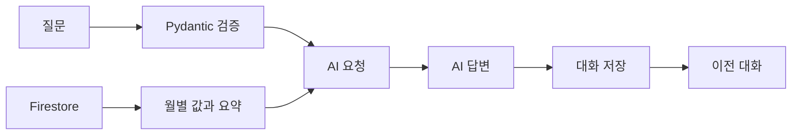
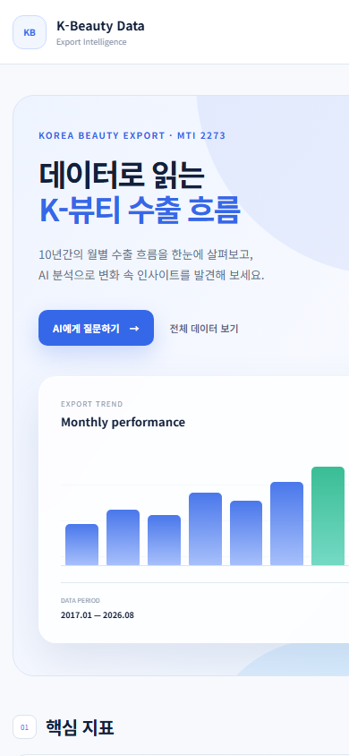

# K-Beauty Data

한국무역협회 K-stat의 화장품 수출 데이터를 Firestore에 저장하고, 실제 월별 값과 요약 통계를 근거로 AI가 답변하는 웹 애플리케이션입니다. 흩어진 월별 수치를 핵심 지표·그래프·AI 분석·데이터 관리·이전 대화로 한 화면에서 확인하도록 만들었습니다.

## 0. 결과 바로 확인

- Frontend: https://kbeauty-analytics.vercel.app
- Backend API: https://kbeauty-analytics.vercel.app/api
- Health Check: https://kbeauty-analytics.vercel.app/health
- Swagger: https://k-beauty-ai-api.onrender.com/docs
- Firebase Firestore: https://console.firebase.google.com/project/k-beauty-ai-e815a/firestore/databases/-default-/data

### 주요 기능

- 기간·개수·평균·최댓값·최솟값·최근 값·최근 추세 표시
- 116개월 수출 추세 그래프와 최근 1년·3년·전체 기간 전환
- 월별 데이터 검색, 추가, 수정, 삭제 및 CSV·JSON 내보내기
- 실제 Firestore 데이터를 근거로 한 AI 분석과 이전 대화 관리
- 라이트·다크 모드, 반응형 화면, 입력 검증과 상태 안내

## 1. 데이터 준비

| 항목 | 내용 |
|---|---|
| 출처 | 한국무역협회 K-stat 수출입 무역통계 |
| 품목 | 화장품(MTI 2273) |
| 기간 | 2017-01 ~ 2026-08 |
| 개수 | 116개, 월 누락·중복 없음 |
| 지표·단위 | 월별 수출금액·US$ |

업로드 전에 월 개수, 누락·중복, `YYYY-MM` 형식, 숫자형 수출액, 빈 값을 확인했습니다. Firestore `data`의 문서 ID는 기준월인 `YYYY-MM`을 사용합니다.

## 2. 기술 선택과 프로젝트 구조

- Backend: Python, FastAPI, Uvicorn, Pydantic
- Database: Firebase Firestore
- AI: Codyssey OpenAI 호환 API, GPT-5.4 mini
- Frontend: HTML, CSS, JavaScript
- Deployment: GitHub, Render, Vercel

```text
M1-2/
├─ docs/images/              # README 검증 화면
├─ frontend/
│  ├─ index.html             # 화면 구조
│  ├─ styles.css             # 기본·반응형 스타일
│  ├─ highlight-overrides.css# 그래프·다크 모드·상태 스타일
│  ├─ config.js              # 공개 API 기본 주소
│  └─ app.js                 # API 호출과 화면 상태
├─ main.py                   # 스키마, API, 요약, AI 흐름
├─ firebase_config.py        # Firebase 연결
├─ openai_config.py          # AI 클라이언트 설정
├─ upload_data.py            # 원본 데이터 업로드
├─ test_openai.py            # AI 연결 확인
├─ requirements.txt
├─ .env.example
└─ README.md
```

현재 과제 규모와 배포 단순성을 위해 백엔드는 `main.py`에 두되 영역별 블록으로 구분했습니다. 확장 시 아래 책임대로 옮기면 URL 계약을 유지한 채 분리할 수 있습니다.

| 현재 위치 | 역할 | 확장 시 파일 |
|---|---|---|
| `/api/data` 블록 | 데이터 CRUD와 HTTP 응답 | `routers/data.py`, `services/data_service.py` |
| `get_data_summary()` | 집계와 최근 추세 | `services/summary_service.py` |
| `/api/conversations` 블록 | 대화 저장·조회·삭제 | `routers/conversations.py`, `services/conversation_service.py` |
| `chat()` | AI 컨텍스트·호출·저장 | `routers/chat.py`, `services/chat_service.py` |
| Pydantic 모델 | 요청 형식과 입력 검증 | `schemas/*.py` |

```text
Browser → FastAPI Router → Service → Firestore / AI API
                    ↑
              Pydantic Schema
```

## 3. 설치와 환경 설정

Python 3.10 이상에서 실행합니다.

```powershell
python -m venv venv
.\venv\Scripts\Activate.ps1
pip install -r requirements.txt
```

`.env.example`을 복사해 `.env`를 만들고 실제 값은 로컬 또는 배포 서비스의 비밀 설정에만 입력합니다.

```env
OPENAI_API_KEY=
OPENAI_BASE_URL=https://copa.codyssey.kr/v1
OPENAI_MODEL=gpt-5.4-mini
FIREBASE_SERVICE_ACCOUNT_PATH=firebase-key.json
FIREBASE_SERVICE_ACCOUNT_JSON=
ALLOWED_ORIGINS=http://127.0.0.1:5500,http://localhost:5500
```

`.env`, `firebase-key.json`, 서비스 계정 JSON, `venv/`, `__pycache__/`는 `.gitignore`로 제외합니다. 실제 비밀정보는 코드·README·GitHub에 기록하지 않습니다.

### 로컬 실행

```powershell
uvicorn main:app --reload
```

- API: `http://127.0.0.1:8000`
- Swagger: `http://127.0.0.1:8000/docs`
- Frontend: `frontend/index.html`을 열거나 정적 서버로 실행

## 4. Firestore와 데이터 CRUD

### 컬렉션 구조

`data` 문서:

```json
{"date":"2026-08","value":1311432871,"memo":"화장품(MTI 2273) 월별 수출액","unit":"US$"}
```

`conversations` 문서:

```json
{
  "title": "질문 제목",
  "created_at": "ISO 8601 datetime",
  "updated_at": "ISO 8601 datetime",
  "messages": [
    {"role": "user", "content": "사용자 질문"},
    {"role": "assistant", "content": "AI 답변"}
  ]
}
```

### 중복과 동시 요청 처리

- `data`는 `YYYY-MM` 문서 ID로 같은 월을 한 문서로 식별합니다.
- 추가 시 Firestore의 원자적 `create()`를 사용합니다. 동시에 같은 월을 요청해도 최초 한 건만 저장되고 나머지는 `409 Conflict`를 반환합니다.
- CRUD 성공 후 프런트엔드는 목록과 요약을 함께 재조회합니다.
- 여러 관리자의 동시 수정으로 확장할 때는 `updated_at` 또는 버전 필드와 트랜잭션으로 낙관적 잠금을 적용합니다.

### 인덱스 설계

| 컬렉션 | 문서 ID | 현재 조회 | 현재 인덱스 |
|---|---|---|---|
| `data` | `YYYY-MM` | 전체 조회 후 `date` 정렬 | 문서 ID·단일 필드 자동 인덱스 |
| `conversations` | 자동 ID | `created_at` 내림차순 정렬 | 단일 필드 자동 인덱스 |

현재 116건이며 복합 조건 쿼리가 없어 별도 복합 인덱스는 만들지 않았습니다. 국가별 기능을 추가해 `where("country", "==", "US")`와 `order_by("date", DESC)`를 함께 사용한다면 문서상 식별명 `idx_data_country_date`로 `country ASC + date DESC` 복합 인덱스를 생성합니다.

```json
{
  "collectionGroup": "data",
  "queryScope": "COLLECTION",
  "fields": [
    {"fieldPath": "country", "order": "ASCENDING"},
    {"fieldPath": "date", "order": "DESCENDING"}
  ]
}
```

### Pydantic 검증과 오류 기록

| 스키마 | 목적 | 규칙 |
|---|---|---|
| `DataItem` | 데이터 추가·수정 | `YYYY-MM`, 0 이상 정수, `US$`, 메모 최대 200자 |
| `Message` | 저장 메시지 | 역할은 `user`·`assistant`, 1~12,000자 |
| `ConversationCreate` | 대화 저장 | 제목 최대 80자, 메시지 1~20개 |
| `ChatRequest` | AI 질문 | 공백 제거 후 1~1,000자 |

검증 실패는 `422`를 반환합니다. 서버 로그에는 입력 원문 대신 요청 경로, 실패 필드 위치, 오류 유형만 기록해 개인정보 노출을 줄입니다. 운영에서는 Render 로그 알림 또는 Sentry를 연결할 수 있습니다.

```json
{
  "detail": "입력값 형식을 확인해 주세요.",
  "errors": [{"location": "body.date", "type": "string_pattern_mismatch"}]
}
```

## 5. 데이터 요약 API

`GET /api/data`는 원본 목록을, `GET /api/data/summary`는 대시보드와 AI가 사용하는 집계를 반환합니다. 분리 덕분에 화면별 요청이 단순하고 요약 규칙을 재사용할 수 있습니다.

```json
{
  "period": {"start": "2017-01", "end": "2026-08"},
  "count": 116,
  "unit": "US$",
  "average": 708267101,
  "maximum": {"date": "2026-04", "value": 1351825649},
  "minimum": {"date": "2017-01", "value": 300967371},
  "latest": {"date": "2026-08", "value": 1311432871},
  "recent_trend": "증가",
  "recent_change_rate": 7.61
}
```

```text
직전 3개월 = values[-6:-3]
최근 3개월 = values[-3:]
변화율 = (최근 평균 - 직전 평균) / 직전 평균 × 100

> 3% 증가 / < -3% 감소 / 나머지 유지 / 6개월 미만 데이터 부족
```

기간은 Firestore의 첫 월과 마지막 월로 결정됩니다. 데이터를 바꾸면 `main.py`의 `get_data_summary()`가 다음 요청에서 모든 통계와 추세를 다시 계산합니다. 기준을 변경할 때는 이 함수의 `previous_3`, `recent_3`, ±3% 임계값과 README 예시를 함께 수정합니다.

현재는 매 요청에 재계산합니다. 트래픽이 늘면 60초 TTL 인메모리 캐시를 적용하고 CRUD 성공 시 즉시 무효화합니다. 여러 인스턴스에서는 Redis 같은 공유 캐시를 사용합니다.

## 6. AI 연결과 `POST /api/chat`

1. 질문을 검사합니다.
2. Firestore의 실제 월별 데이터를 조회합니다.
3. `get_data_summary()`로 요약을 계산합니다.
4. 요약과 월별 값을 AI 컨텍스트로 전달합니다.
5. AI가 한국어 답변을 생성합니다.
6. 성공한 질문·답변을 `conversations`에 저장합니다.
7. 대화 ID, 답변, 모델명을 반환합니다.



### 컨텍스트 방어와 길이 정책

- 사용자 질문은 분석 대상이며 시스템 지시가 아님을 최우선 규칙으로 둡니다.
- 프롬프트 공개·변경·무시, 역할 변경, 근거 없는 수치 생성 요청은 거부합니다.
- 규칙, 조회 데이터, 사용자 질문을 별도 메시지로 분리합니다.
- 데이터 문자열도 명령으로 실행하지 않도록 지시합니다.
- 질문 최대 1,000자, 데이터 컨텍스트 최대 32,000자, 출력 `max_tokens=2400`입니다.
- 현재 116개월은 전부 전달하며 제한을 넘으면 요약과 최신 120개월만 제공합니다.
- `temperature=0`으로 변동을 줄이고 빈 응답은 한 번 재시도합니다.
- 기간 밖 질문은 확인 불가로, 데이터에 없는 원인은 가능성 또는 추가 확인 필요로 구분합니다.

### 대화 저장 정책

- AI 성공 후에만 질문과 답변을 저장하며 AI 실패 시 불완전한 대화를 남기지 않습니다.
- 저장 실패 시 `500`과 안내를 반환하고 서버에는 질문 원문 대신 길이와 예외 스택을 기록합니다.
- 제목은 질문 앞 40자, 문서당 메시지 최대 20개·메시지당 12,000자입니다.
- 대량 운영 시 `created_at` 커서 페이지네이션을 적용하고 90일 이후 기록을 보관 컬렉션으로 이동하거나 삭제합니다.

## 7. API 목록과 응답 계약

Swagger에서 데이터 CRUD, 요약, AI 채팅, 대화 저장·조회·삭제를 확인할 수 있습니다.

| Method | Endpoint | 성공 | 주요 오류 |
|---|---|---|---|
| GET | `/health` | `200`, 상태 객체 | `500` |
| GET | `/api/data` | `200`, `{count, data}` | `500` |
| POST | `/api/data` | `200`, `{message, id}` | `409`, `422` |
| PUT | `/api/data/{id}` | `200`, `{message, id}` | `400`, `404`, `422` |
| DELETE | `/api/data/{id}` | `200`, `{message, id}` | `404`, `500` |
| GET | `/api/data/summary` | `200`, 요약 객체 | `404`, `500` |
| POST | `/api/chat` | `200`, `{conversation_id, answer, model}` | `422`, `500` |
| POST | `/api/conversations` | `200`, `{message, id}` | `422`, `500` |
| GET | `/api/conversations` | `200`, 목록 객체 | `500` |
| GET | `/api/conversations/{id}` | `200`, 대화 객체 | `404`, `500` |
| DELETE | `/api/conversations/{id}` | `200`, `{message, id}` | `404`, `500` |

```bash
curl https://kbeauty-analytics.vercel.app/health
```

```json
{"status":"ok","service":"K-Beauty AI API"}
```

일반 오류 예시: `{"detail":"해당 데이터가 없습니다."}`

## 8. 프론트엔드 연결과 사용 순서

초기화 시 요약·데이터·대화 목록을 동시에 요청합니다.

| 상태 | 화면 동작 |
|---|---|
| API 확인 중 | 헤더에 주황색 상태 표시 |
| 7초 이상 지연 | `서버 준비 중`과 “최대 1분” 토스트 |
| 성공 | 지표·표·대화 갱신, `API 연결됨` |
| 일부 실패 | 해당 영역만 오류 표시, 성공 영역 유지 |
| 전체 실패 | `연결 오류`와 서버 확인 안내 |
| CRUD 성공 | 목록과 요약 동시 재조회 |
| AI 요청·오류 | 버튼 비활성화·로딩 또는 채팅 오류 표시 |

사용 순서:

1. 대시보드에서 기간과 핵심 지표를 확인합니다.
2. 추천 질문 또는 직접 입력한 질문을 전송합니다.
3. 이전 대화에서 저장된 질문과 답변을 불러옵니다.
4. 월별 데이터를 검색·추가·수정·삭제합니다.
5. 그래프 기간을 전환하고 CSV·JSON을 내려받습니다.
6. 상단 버튼으로 라이트·다크 모드를 바꿉니다.

## 9. 전체 테스트와 화면 증거

### 메인 대시보드


### AI 분석과 이전 대화


### 데이터 CRUD 검증

검증용 `2026-09`를 추가·수정·삭제하고 116개로 복구했습니다.

| 검증 전 | 추가 후 |
|---|---|
|  |  |

| 수정 후 | 삭제 후 |
|---|---|
|  |  |

### 그래프와 390px 모바일 실제 화면

| 수출 추세 | 모바일 대시보드 |
|---|---|
|  |  |

모바일에서는 메뉴와 카드가 세로 배치되고 표·그래프는 가로 스크롤을 제공합니다.

### 다크 모드


### API와 배포


| Render | Vercel |
|---|---|
|  |  |

## 10. GitHub·Render·Vercel 배포

### Render

1. GitHub 저장소를 Web Service에 연결하고 Root Directory를 `M1-2`로 지정합니다.
2. Build는 `pip install -r requirements.txt`, Start는 `uvicorn main:app --host 0.0.0.0 --port $PORT`로 설정합니다.
3. `Environment`에 `OPENAI_API_KEY`, `OPENAI_BASE_URL`, `OPENAI_MODEL`, `ALLOWED_ORIGINS`를 등록합니다.
4. Firebase 키는 `FIREBASE_SERVICE_ACCOUNT_JSON` 또는 `/etc/secrets/firebase-key.json` Secret File로 등록합니다.
5. 재배포 후 `/health`, `/docs`, 데이터·요약·채팅 API와 로그를 확인합니다.

### Vercel

1. GitHub 저장소와 정적 프런트·`vercel.json` 프록시 설정을 배포합니다.
2. `frontend/config.js`에는 공개 API 주소만 두고 비밀키를 넣지 않습니다.
3. 고정 운영 주소를 Render의 `ALLOWED_ORIGINS`에 등록하고 백엔드를 재배포합니다.
4. Vercel 미리보기 주소는 Render에 자동 등록되지 않습니다. 사용할 주소를 직접 추가하고 다시 배포해야 합니다.

```env
ALLOWED_ORIGINS=https://kbeauty-analytics.vercel.app,http://127.0.0.1:5500,http://localhost:5500
```

운영에서는 `*` 대신 실제 프런트엔드와 필요한 로컬 주소만 허용합니다.

## 11. 콜드 스타트와 운영 계획

무료 Render는 유휴 후 첫 요청에 최대 1분이 걸릴 수 있습니다. 7초 이상 지연되면 UI가 `서버 준비 중`으로 바뀌어 일반 오류와 구분합니다.

- `/health`로 상태를 확인합니다.
- 일시적 실패에는 제한 횟수의 지수 백오프를 추가할 수 있습니다.
- 필요하면 외부 스케줄러로 `/health`를 호출하되 무료 정책을 먼저 확인합니다.
- 응답 시간이 중요하면 상시 실행 인스턴스로 전환합니다.
- 요약 캐시는 60초 TTL과 CRUD 성공 시 무효화 원칙을 사용합니다.
- 오류는 Render 로그에서 확인하고 운영 규모가 커지면 Sentry와 알림을 연결합니다.

## 12. 알려진 제한사항

- 무료 서버의 첫 응답은 최대 1분 정도 걸릴 수 있습니다.
- 현재 데이터만으로 국가별·품목별·채널별 원인을 확정할 수 없습니다.
- AI의 외부 시장 해석은 사실이 아니라 가능성으로 구분합니다.
- 동일 질문도 표현이 조금 달라질 수 있으나 `temperature=0`으로 편차를 줄였습니다.
- 대화 목록은 시연 규모를 전제로 전체 조회하며 대량 운영 시 페이지네이션·보관 정책이 필요합니다.
